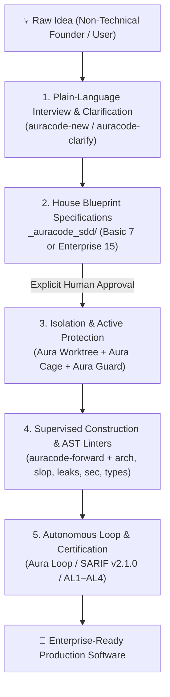

# AuraCode — Agentic Unified Reliability & Assurance Framework

> **AuraCode** (**A**gentic **U**nified **R**eliability & **A**ssurance for **Code**)  
> **Status: 0.3.0 (Stable / V2.0 Strategic Modernization) — AST Verification Engine, Active Agent Isolation, DevContainer Sandboxing, Graduated SDD Profiles, Mutation Testing, Polyglot Scanners, Lay-User TUI Wizard & Adversarial Debates**  
> **Language Support:** Architectural principles, container isolation, and governance controls are language-agnostic. The automated syntax analysis engine (`auracode multilang`) natively inspects **Python, TypeScript, JavaScript, Go, Java, and C#**.

[](README.pt-BR.md)
[](LICENSE)
[-brightgreen.svg)](tests/)
[](tools/)

A vendor-neutral, evidence-gated framework and active governance toolkit for building, auditing, and operating professional software developed with substantial assistance from large language models (LLMs) and autonomous coding agents—specifically designed to guide **lay and non-technical users** through building software from scratch or modernizing existing systems using senior software engineering best practices.

---

## 📖 Manifesto: AI Software Assurance & Lay-User Pair Programming

Artificial intelligence has fundamentally transformed software engineering. Large Language Models (LLMs) and autonomous coding agents can now interpret requirements, refactor systems, invoke tools, and generate thousands of lines of code in seconds. However, this velocity introduces critical risks when non-technical users interact with AI: hallucinated dependencies, silent assumptions, architectural erosion, superficial test suites (*vitiated oracles*), prompt injection vulnerabilities, and *"AI slop"* (bloated code, forgotten stubs, and unnecessary abstractions).

AuraCode bridges this gap through **Zero-Trust AI Pair Programming for Non-Technical Users**:

> **AI Zero Trust & Zero Presumption:** Do not trust AI simply because the output looks plausible. AI must never silently guess requirements, interfaces, or technical trade-offs. Demand empirical evidence and explicit human authorization for every decision.

### Core Principles of AuraCode

1. **Zero-Presumption Directive (Tolerância Zero a Presunções):** The AI agent is strictly forbidden from inferring or deciding business rules, screen behaviors, data models, or error cases on its own. Every ambiguity—no matter how small—triggers a plain-language question to the user.
2. **House Blueprint First Paradigm (`_auracode_sdd/`):** Just like constructing a house, no application code, directories, or scripts are generated before the complete theoretical architecture (frontend, backend, database, security, APIs, design system, assurance level AL1-AL4) is fully specified and reviewed in markdown blueprints under `_auracode_sdd/` (4 graduated profiles: `micro` [1 spec], `lite` [3 specs], `standard` [7 specs], or `enterprise` [15 specs]).
3. **Plain-Language Dialogue & Physical World Analogies:** Complex technical trade-offs are translated into real-world analogies (e.g., Database $\rightarrow$ *"Smart Filing Cabinet"*, Backend $\rightarrow$ *"Restaurant Kitchen"*, API $\rightarrow$ *"Waiter taking orders"*, Frontend $\rightarrow$ *"Storefront counter"*, Authentication $\rightarrow$ *"ID Badge"*). Structured choice menus with simple pros and cons are provided whenever technical options arise.
4. **Active Contention & Safe Sandboxing:** The agent cannot touch the developer's main branch, execute dangerous OS commands, or freely transmit data over the internet. AuraCode enforces physical Git Worktree isolation, fail-closed Pre-Tool hooks, and hermetic DevContainers with Default-Deny firewalls.
5. **Native AST Static Analysis & Mutation Testing (`auracode <command>`):** Deterministic syntax analyzers inspect code for LLM anti-patterns without relying on LLMs to judge LLMs: hunts dead code and stubs (`auracode slop`), prevents resource leaks (`auracode leaks`), catches injection vectors (`auracode sec`), enforces strict type hints (`auracode types`), isolates Clean Architecture layers (`auracode arch`), inspects polyglot codebases (`auracode multilang`), executes lightweight AST mutation testing to kill fake test oracles (`auracode tests --mutate`), and restricts diffs to under 500 lines while forbidding unauthorized test tampering (`auracode diff`).
6. **Progressive Assurance Levels (AL1 to AL4):** From low-risk local utilities (AL1) to mission-critical financial infrastructure (AL4), verification rigor scales proportionally with the impact of failure.

---

## 🛡️ The 5 Pillars of V2.0 Modernization

Based on the engineering principles codified in the comprehensive treatise [*Engenharia de Software com Agentes Inteligentes*](RESUMO_ENGENHARIA_SOFTWARE_AGENTES_INTELIGENTES.md), AuraCode V2.0 introduces 5 core structural fronts for enterprise agentic reliability:

```
┌─────────────────────────────────────────────────────────────────────────────────────────┐
│                                   AURACODE V2.0 STACK                                   │
├──────────────────────────┬─────────────────────────────┬────────────────────────────────┤
│      1. AURA GUARD       │       2. AURA WORKTREE      │       3. SDD ENTERPRISE        │
│ Fail-closed pre/post-tool│ Physical branch isolation   │ 15 modular specs covering      │
│ hooks intercepting OS/git│ ensuring zero dirty working │ compliance, telemetry, DR,     │
│ and blocking exfiltration│ trees on developer branch   │ threat modeling & architecture │
├──────────────────────────┴─────────────────────────────┴────────────────────────────────┤
│      4. AURA CAGE                                      │ 5. AURA LOOP                   │
│ Hermetic DevContainer with Default-Deny outbound        │ Stateless Ralph Architecture   │
│ firewall neutralizing indirect prompt injection attacks│ runner with 5-level AST gates  │
└────────────────────────────────────────────────────────┴────────────────────────────────┘
```

### 1. Aura Guard: Active Pre/Post-Tool Execution Hooks (`auracode guard`)
- Intercepts all tool invocations before execution via `.agents/hooks.json` and `tools/pre_tool_guard.py`.
- **Fail-Closed Protection:** Blocks destructive terminal commands (`rm -rf /`, `rmdir /s /q C:\`, disk formatting, `dd`, `git reset --hard HEAD~10`).
- **Data Exfiltration Defense:** Blocks commands that attempt to pipe sensitive environment tokens, private keys (`id_rsa`), or AWS/database credentials to remote URLs via `curl`, `wget`, or netcat.
- Quick setup: `auracode guard install .` or direct audit check: `auracode guard check --tool run_command --cmd "rm -rf /"`.

### 2. Aura Worktree: Physical Git Isolation (`auracode worktree`)
- Eliminates "dirty working tree" chaos by isolating every agent session inside an independent physical Git worktree directory under `.auracode/worktrees/<task>`.
- The developer's active branch and unstaged work remain 100% clean and untouched.
- Commands:
  - `auracode worktree create --task auth-feature`
  - `auracode worktree list`
  - `auracode worktree merge --task auth-feature`
  - `auracode worktree clean --task auth-feature`

### 3. SDD Enterprise Architecture: 15 Modular Specs (`auracode init --profile enterprise`)
- Extends the baseline 7-blueprint House Blueprint to 15 enterprise-grade specification cadernos:
  1. `01_visao_geral_e_negocio.md` — Core vision and business domain.
  2. `02_arquitetura_e_componentes.md` — Clean Architecture boundaries and structural layout.
  3. `03_modelo_de_dados_e_armazenamento.md` — Schema, relational mapping, and persistence.
  4. `04_seguranca_e_permissoes.md` — RBAC, identity boundaries, and cryptography.
  5. `05_apis_e_integracoes.md` — Contract gateways and webhook specifications.
  6. `06_interface_e_design_system.md` — Storefront design system and UI components.
  7. `07_nivel_de_garantia_e_testes.md` — Assurance Level targets (AL1–AL4) and test pyramid.
  8. `08_observabilidade_e_telemetria.md` — Distributed tracing, structured metrics, and health checks.
  9. `09_conformidade_e_privacidade.md` — LGPD/GDPR compliance, data retention, and anonymization.
  10. `10_resiliencia_e_recuperacao.md` — Disaster recovery, circuit breakers, and RTO/RPO objectives.
  11. `11_modelo_de_ameacas.md` — STRIDE threat modeling, attack surface, and counter-measures.
  12. `12_escalabilidade_e_cache.md` — Horizontal scaling policies and caching invalidation strategies.
  13. `13_integracoes_externas.md` — Upstream/downstream partner SLAs, timeouts, and fallbacks.
  14. `14_migracao_e_legado.md` — Database versioning, migration rollback paths, and legacy bridging.
  15. `15_implantacao_e_rollout.md` — Blue/green deployment, canary releases, and rollback criteria.

### 4. Aura Cage: Hermetic DevContainers with Default-Deny Firewall (`auracode cage`)
- Solves the critical security risk of autonomous / "YOLO mode" agent execution.
- Generates an isolated Linux DevContainer equipped with `iptables` running in a strict **Default-Deny** network policy.
- All outbound traffic is blocked by default; only explicitly authorized endpoints (e.g. PyPI, GitHub, internal APIs listed in `allowed-domains.txt`) are permitted.
- Neutralizes indirect prompt injection attacks where malicious web or code content commands the agent to exfiltrate proprietary source code or credentials to external servers.
- Commands:
  - `auracode cage init .`
  - `auracode cage verify`

### 5. Aura Loop: Ralph Architecture Autonomous Runner (`auracode loop`)
- Implements the stateless runner pattern inspired by Geoffrey Huntley's Ralph Architecture.
- **Anti-Dumb-Zone:** Prevents cognitive degradation occurring in LLMs when context windows exceed 100k tokens. Every iteration runs in a fresh, clean context driven by explicit file state.
- **Anti-Reward-Hacking:** Enforces 5 strict deterministic verification levels (Compilation $\rightarrow$ AST Linters $\rightarrow$ Unit Tests $\rightarrow$ Semantic Coverage $\rightarrow$ Security Check) after each turn. If an agent attempts to delete tests or weaken assertions to claim success, the iteration is rejected.
- **Circuit Breaker:** Automatic emergency halt if 3 consecutive failures occur, preventing wasteful token loops.
- Commands:
  - `auracode loop run --max-turns 10`
  - `auracode loop status`
  - `auracode loop reset`

---

## 🏛️ From Idea to Production: The Senior-Grade Guided Journey

AuraCode transforms chaotic AI interaction (often marked by silent assumptions and hallucinated code—commonly termed *Vibe Coding*) into a disciplined, **Senior-Level Software Engineering Journey**. Any founder, product owner, or non-technical creator is guided from scratch to delivering a production-ready, enterprise-grade software system.



### 1. The Analogy: The "Senior Chief Engineer" vs. The "Hasty Mason"
* **Conventional AI (*Vibe Coding*):** Acts like a hasty mason who immediately pours cement and lays bricks on bare soil without a foundation or plumbing blueprints. The structure might look nice on day one, but it cracks, leaks, and collapses under production traffic.
* **AuraCode (*Senior Pair Programming*):** Acts like a Senior Chief Engineer who sits down with you, designs the complete architectural blueprint in plain human terms, explains where each load-bearing column goes, and **strictly forbids laying a single brick** before you understand and approve the blueprint. During construction, every line of code is inspected with laser-precise AST linters, contained in safe worktrees, and guarded by real-time firewalls.

---

### 2. The 5-Phase Production Scope of Work

#### 📋 Phase 1: Zero-Jargon Briefing & Clarification
* **Zero-Presumption Directive:** The AI is forbidden from guessing data models, screen behavior, or business rules.
* **Physical World Analogies:** Technical concepts are translated into daily physical terms (Database $\rightarrow$ *"Smart Filing Cabinet"*, Backend $\rightarrow$ *"Restaurant Kitchen"*, API $\rightarrow$ *"Order Waiter"*, Authentication $\rightarrow$ *"Building Badge"*).
* **Gate G1 Ambiguity Scanner:** The `auracode ambiguity` command scans requirements for vague phrasing (*"maybe"*, *"should work"*, *"standard way"*), enforcing absolute clarity.

#### 📐 Phase 2: The House Blueprint — SDD Specifications (`_auracode_sdd/`)
No code is generated before explicit user sign-off on the specification blueprints:
* **Micro Profile (`--profile micro`):** 1 concise task/utility spec (`01_task_spec.md`) for quick scripts and bugfixes (AL1).
* **Lite Profile (`--profile lite`):** 3 essential blueprints (Vision & Rules, Architecture & Data, Tests & Acceptance) for MVPs and validation (AL2).
* **Standard Profile (`--profile standard` or `--profile basic`):** 7 core architectural blueprints for production web and backend systems (AL3).
* **Enterprise Profile (`--profile enterprise`):** 15 comprehensive blueprints for mission-critical, regulated, and high-scale systems (AL4).

#### 🔒 Phase 3: Sandboxed & Isolated Execution Environment
* **Aura Worktree:** Creates an isolated branch workspace (`.auracode/worktrees/<task>`), safeguarding the developer's working directory.
* **Aura Cage:** Generates a DevContainer with a Default-Deny firewall to thwart prompt injection and unauthorized network exfiltration.
* **Aura Guard:** Activates pre-tool hooks to block destructive OS commands and token theft in real time.

#### 🏗️ Phase 4: Supervised Construction & Clean Architecture
Implementation (`auracode-forward`) is strictly governed by deterministic AST linters:
* **Hermetic Boundaries:** Clean Architecture layers (`domain/`, `usecases/`, `adapters/`, `infrastructure/`, `tests/`), validated by `auracode arch`.
* **Zero AI Slop:** `auracode slop` rejects empty stubs, dead code, and swallowed exceptions (`except: pass`).
* **Resource Leak Prevention:** `auracode leaks` enforces context managers (`with`) on files, sockets, and DB connections.
* **Strict Type Safety:** `auracode types` enforces explicit function signatures and flags untyped `Any`.
* **Injection Vector Immunity:** `auracode sec` blocks `eval`, `exec`, SQL string concatenations, and `shell=True`.
* **Supply Chain Guardrails:** `auracode deps` checks packages against official PyPI indexes before installation.
* **Surgical Diffs:** `auracode diff` limits churn to under 500 lines per cycle and blocks test tampering (*anti-reward hacking*).

#### 🛡️ Phase 5: Autonomous Loop Execution & Production Certification
* **Aura Loop:** Multi-turn autonomous iterations under Ralph Architecture with state reset to eliminate cognitive degradation.
* **OASIS SARIF v2.1.0 Integration:** Unified findings format ingested by GitHub Advanced Security, SonarQube, and VS Code.
* **Global Security Standards:** Control coverage mapped to NIST SSDF 1.1, OWASP LLM Top 10, CWE Top 25, and ISO 25010.
* **Non-Vacuous Test Suites:** `auracode tests` audits test ASTs to ensure assertions are semantic and meaningful (zero `assert True`).

---

### 3. Comparison: Conventional AI (Vibe Coding) vs. AuraCode

| Engineering Criterion | Conventional AI (*Vibe Coding*) | AuraCode (*Senior Pair Programming*) |
| :--- | :--- | :--- |
| **Project Kickoff** | Generates code immediately without understanding real scope | Structured interview and SDD Blueprint sign-off (Basic 7 or Enterprise 15) |
| **Missing Requirements** | AI guesses silently and makes unverified architectural choices | **Zero Presumption:** AI pauses and provides structured options with analogies |
| **Code Architecture** | Spaghetti code mixing DB, business logic, and UI in single files | **Clean Architecture** with inward dependency AST contracts (`contracts.json`) |
| **Working Directory** | Dirty working trees, broken uncommitted files, overwritten code | **Aura Worktree:** Complete physical Git directory isolation per task |
| **Host System Safety** | Executes dangerous commands (`rm -rf`, format) blindly | **Aura Guard:** Real-time fail-closed hooks intercepting destructive actions |
| **Network & Injection** | Open network access vulnerable to prompt injection exfiltration | **Aura Cage:** Hermetic DevContainer with Default-Deny iptables firewall |
| **Error Handling** | Errors swallowed with empty `try/catch` or `except: pass` | **Fail-Closed:** AST linters block dead code and silent swallows (`auracode slop`) |
| **Autonomous Runner** | Long-context degradation (Dumb Zone) and hallucinated tasks | **Aura Loop:** Stateless Ralph Architecture runner with 5-level AST gates |
| **Dependencies** | Frequent package hallucinations and supply chain vulnerabilities | Cryptographic verification against official package registries (`auracode deps`) |
| **Test Suite Quality** | Tautological or fake tests (`assert True`) that test nothing | AST Visitor (`auracode tests`) enforces semantic asserts and blocks tampering |
| **Production Readiness** | Heavy technical debt requiring total rewrite by senior engineers | **Enterprise Ready:** Modular, auditable, and certified software (AL1–AL4) |

---

## 🚀 Quick Start & Installation

### Option 1: Instant Execution via `uvx` (No installation needed, like `npx`)

Run any AuraCode command directly in an isolated environment without manual setup or cloning:

```bash
# Initialize workspace with Enterprise 15-spec blueprints
uvx --from git+https://github.com/Maferreira25/Aura-Code.git auracode init --profile enterprise

# Scan current project for AI slop and swallowed exceptions
uvx --from git+https://github.com/Maferreira25/Aura-Code.git auracode slop .

# Scan for injection vulnerabilities and shell risks
uvx --from git+https://github.com/Maferreira25/Aura-Code.git auracode sec .

# Start the stdio MCP server for Antigravity IDE / Cursor / Claude Desktop
uvx --from git+https://github.com/Maferreira25/Aura-Code.git auracode mcp
```

### Option 2: Local Installation via `pip`

Install AuraCode into your Python environment:

```bash
git clone https://github.com/Maferreira25/Aura-Code.git
cd Aura-Code
pip install -e .
```

Verify installation:
```bash
auracode --help
```

---

## 🛠️ Complete 20-Command CLI Reference (`auracode <command>`)

AuraCode provides 20 unified static AST, containment, mutation testing, multi-language, TUI briefing, and governance commands:

```bash
# 1. Initialize workspace directories and SDD blueprints (profile: micro, lite, standard, enterprise)
auracode init --profile standard

# 2. Interactive Terminal Briefing Wizard for lay users (Zero Jargon TUI)
auracode wizard
# or alias: auracode interview

# 3. Evaluate requirement ambiguity & generate clarifying non-technical questions (Gate G1)
auracode ambiguity .

# 4. Scan Python AST for dead code, unreachable code, and swallowed errors
auracode slop .

# 5. Scan Python AST for unclosed resource leaks (file handles, sockets, DB connections)
auracode leaks .

# 6. Scan Python AST for strict type hints and unconstrained 'Any' usage
auracode types .

# 7. Scan test suite integrity, detect vacuous tests, or execute AST mutation testing
auracode tests .
auracode tests --mutate -s tools/multilang_runner.py -t tests/test_multilang_runner.py

# 8. Scan multi-language codebases (Python, TS, JS, Go, Java, C#) with unified SARIF reporting
auracode multilang .

# 9. Scan Python AST for injection vectors (eval/exec, shell=True, SQL injection)
auracode sec .

# 10. Verify Clean Architecture layer boundaries using AST contracts
auracode arch .

# 11. Verify dependencies against PyPI to prevent hallucinated packages (slopsquatting)
auracode deps .

# 12. Verify that repository changes are surgical (< 500 lines) and block test tampering
auracode diff .

# 13. Ingest external SARIF 2.1.0 or JSON linter findings for unified reporting
auracode sarif linter-report.json

# 14. Assess project against an Assurance Level (AL1-AL4)
auracode assess assessment.json

# 15. Start stdio Model Context Protocol (MCP) server for IDE integration
auracode mcp

# 16. Real-time Pre-Tool Execution Safety Guardrail (Aura Guard)
auracode guard check --tool run_command --cmd "git status"
auracode guard install .

# 17. Physical Directory Isolation for AI Agents (Aura Worktree)
auracode worktree create --task auth-feature
auracode worktree list
auracode worktree merge --task auth-feature
auracode worktree clean --task auth-feature

# 18. DevContainer Sandbox & Default-Deny Firewall Manager (Aura Cage)
auracode cage init .
auracode cage verify

# 19. Autonomous Loop Runner based on Ralph Architecture (Aura Loop)
auracode loop run --max-turns 10
auracode loop status
auracode loop reset

# 20. Structured 3-Phase Adversarial Agentic Debate (Party Mode with Containment)
auracode debate "Sistema de Armazenamento de Arquivos"
```

---

## 🤖 AuraCode Active Skills & Persona Swarms (`.agents/skills/`)

AuraCode defines 15 specialized IDE skills enforcing non-technical dialogue protocols, containment, and strict evidence scales:

1. **`auracode`**: Main framework entry point and command navigator.
2. **`auracode-new`**: Greenfield project workflow conducting plain-language interviews and generating House Blueprints in `_auracode_sdd/`.
3. **`auracode-clarify`**: Non-technical requirement dialogue generator with zero presumptions and analogy menus.
4. **`auracode-brainstorm`**: Ideation and scope framing agent translating raw user concepts into plain-language feature menus.
5. **`auracode-forward`**: Spec-driven execution agent implementing Clean Architecture code (`domain/`, `usecases/`, `adapters/`, `infrastructure/`, `tests/`) strictly from approved blueprints.
6. **`auracode-adversary`**: Red-team assurance challenger identifying architectural risks, edge cases, and vitiated tests before production deployment.
7. **`auracode-debate`**: Structured 3-phase adversarial debate orchestrator ensuring balanced trade-off analysis with lay-user physical analogies.
8. **`auracode-guard`**: Active execution safety gate intercepting commands and protecting the operating system.
9. **`auracode-worktree`**: Git physical directory isolation manager for agent workflows.
10. **`auracode-cage`**: DevContainer sandbox architect enforcing Default-Deny firewalls.
11. **`auracode-loop`**: Autonomous Ralph Architecture loop runner with 5-level AST verification gates.
12. **`auracode-audit`**: Autonomous QA runner executing the full 20-part `auracode` static analysis suite.
13. **`auracode-debugger`**: Bug investigator reproducing failures via failing unit tests first before applying minimal surgical fixes.
14. **`auracode-refactor`**: Quality specialist eliminating slop, unclosed resources, and missing type hints without altering public APIs.
15. **`auracode-agents-help`**: Explanatory catalog detailing the specialized agent personas using plain-language analogies.

---

## 📚 Theoretical Foundation & Complete Reference Guide

AuraCode V2.0 is built upon the comprehensive body of knowledge detailed in our accompanying treatise:

📖 **[Resumo de Engenharia de Software com Agentes Inteligentes](RESUMO_ENGENHARIA_SOFTWARE_AGENTES_INTELIGENTES.md)** (113 KB, 9 Chapters)
* *Chapter 1:* Foundations of Agentic Software Engineering
* *Chapter 2:* Architectures of Intelligent Agents (ReAct, Plan-and-Solve, Ralph)
* *Chapter 3:* Specification-Driven Development (SDD) & Enterprise Blueprints
* *Chapter 4:* Physical Worktree Isolation & Active Guard Hooks
* *Chapter 5:* Hermetic DevContainers & Default-Deny Network Sandboxing
* *Chapter 6:* AST Static Verification & AI Slop Elimination
* *Chapter 7:* Anti-Reward-Hacking & Non-Vacuous Test Suites
* *Chapter 8:* Autonomous Loop Engineering & Context Decay Prevention
* *Chapter 9:* Socio-Technical Governance & Continuous Assurance Levels (AL1–AL4)

---

## 🧪 Test Suite & Quality Verification

AuraCode maintains 100% test coverage across all assurance tools:

```bash
# Run complete test suite (144 unit tests)
python -m unittest discover -s tests -p "test_*.py"

# Run AST linters across AuraCode codebase
auracode arch .
auracode slop .
auracode leaks .
auracode sec .
auracode types .
auracode tests .
auracode multilang .
```

- **Total Test Cases:** 144 passing unit tests (0 failures, 0 errors).
- **AST Violations:** 0 across all 8 linters and analyzers.
- **External Dependencies:** Zero (Pure Python standard library for core tools).

---

## 📜 License & Governance

Licensed under the **MIT License**. Open-source, vendor-neutral, and community-driven.
