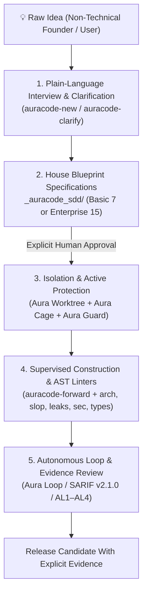

# AuraCode — Agentic Unified Reliability & Assurance Framework

> **AuraCode** (**A**gentic **U**nified **R**eliability & **A**ssurance for **Code**)  
> **Status: 0.3.0.dev0 (Development Preview) — active implementation and validation**  
> **Language Support:** Python has structural AST checks. TypeScript, JavaScript, Go, Java, and C# currently have partial heuristic checks and are not yet certified as equivalent AST coverage.

[](README.pt-BR.md)
[](LICENSE)
[](ROADMAP.md)

A vendor-neutral assurance toolkit evolving into a guided AI application builder. The current release provides real governance and analysis components, but it is **not yet an end-to-end certified application builder**. The missing builder, packaging, user experience, and empirical validation work is tracked in the [roadmap](ROADMAP.md) and the approved `_auracode_sdd/` specifications.

---

## 📖 Manifesto: AI Software Assurance & Lay-User Pair Programming

Artificial intelligence has fundamentally transformed software engineering. Large Language Models (LLMs) and autonomous coding agents can now interpret requirements, refactor systems, invoke tools, and generate thousands of lines of code in seconds. However, this velocity introduces critical risks when non-technical users interact with AI: hallucinated dependencies, silent assumptions, architectural erosion, superficial test suites (*vitiated oracles*), prompt injection vulnerabilities, and *"AI slop"* (bloated code, forgotten stubs, and unnecessary abstractions).

AuraCode bridges this gap through **Zero-Trust AI Pair Programming for Non-Technical Users**:

> **AI Zero Trust & Zero Presumption:** Do not trust AI simply because the output looks plausible. AI must never silently guess requirements, interfaces, or technical trade-offs. Demand empirical evidence and explicit human authorization for every decision.

### Core Principles of AuraCode

1. **Zero-Presumption Directive (Tolerância Zero a Presunções):** The AI agent is strictly forbidden from inferring or deciding business rules, screen behaviors, data models, or error cases on its own. Every ambiguity—no matter how small—triggers a plain-language question to the user.
2. **House Blueprint First Paradigm (`_auracode_sdd/`):** Just like constructing a house, no application code, directories, or scripts are generated before the complete theoretical architecture (frontend, backend, database, security, APIs, design system, assurance level AL1-AL4) is fully specified and reviewed in markdown blueprints under `_auracode_sdd/` (4 graduated profiles: `micro` [1 spec], `lite` [3 specs], `standard` [7 specs], or `enterprise` [15 specs]).
3. **Plain-Language Dialogue & Physical World Analogies:** Complex technical trade-offs are translated into real-world analogies (e.g., Database $\rightarrow$ *"Smart Filing Cabinet"*, Backend $\rightarrow$ *"Restaurant Kitchen"*, API $\rightarrow$ *"Waiter taking orders"*, Frontend $\rightarrow$ *"Storefront counter"*, Authentication $\rightarrow$ *"ID Badge"*). Structured choice menus with simple pros and cons are provided whenever technical options arise.
4. **Active Containment & Sandboxing Controls:** AuraCode provides Worktree, Guard, and Cage controls. Their protection applies only when installed, configured, and verified for the active execution surface.
5. **Native AST Static Analysis & Mutation Testing (`auracode <command>`):** Deterministic analyzers inspect supported patterns without relying on an LLM as the judge: they flag selected dead-code and stub patterns (`auracode slop`), possible resource leaks (`auracode leaks`), selected injection vectors (`auracode sec`), type-hint violations (`auracode types`), configured Clean Architecture dependency violations (`auracode arch`), and vacuous test patterns (`auracode tests`). Python receives structural AST analysis; the other listed languages currently receive narrower heuristic checks. These checks reduce risk but do not prove the absence of defects.
6. **Progressive Assurance Levels (AL1 to AL4):** From low-risk local utilities (AL1) to mission-critical financial infrastructure (AL4), verification rigor scales proportionally with the impact of failure.

---

## 🛡️ Five Implemented Control Areas

The development preview contains five control areas. Each one has a limited enforcement surface and must be verified in the environment where it is used:

```
┌─────────────────────────────────────────────────────────────────────────────────────────┐
│                                   AURACODE V2.0 STACK                                   │
├──────────────────────────┬─────────────────────────────┬────────────────────────────────┤
│      1. AURA GUARD       │       2. AURA WORKTREE      │       3. SDD ENTERPRISE        │
│ Pattern-based hook checks│ Optional branch isolation   │ 15 specification templates     │
│ on configured surfaces   │ through explicit worktrees  │ requiring human completion     │
│ and recognized commands  │ and verified Git state      │ and approval                    │
├──────────────────────────┴─────────────────────────────┴────────────────────────────────┤
│      4. AURA CAGE                                      │ 5. AURA LOOP                   │
│ DevContainer Default-Deny configuration                 │ Stateful iteration runner      │
│ requiring build and runtime verification                │ with configurable gates        │
└────────────────────────────────────────────────────────┴────────────────────────────────┘
```

### 1. Aura Guard: Active Pre/Post-Tool Execution Hooks (`auracode guard`)
- Inspects invocations only on integrations that load `.agents/hooks.json` and dispatch them through `tools/pre_tool_guard.py`.
- **Pattern-Based Protection:** Rejects the supported destructive command patterns, including representative root deletion, disk-formatting, `dd`, and destructive Git reset forms.
- **Pattern-Based Exfiltration Defense:** Rejects supported patterns that pipe recognized secret names or private-key paths to recognized network tools. It does not inspect every possible shell, tool, encoding, or data-flow path.
- Quick setup: `auracode guard install .` or direct audit check: `auracode guard check --tool run_command --cmd "rm -rf /"`.

### 2. Aura Worktree: Physical Git Isolation (`auracode worktree`)
- Creates an independent Git worktree directory under `.auracode/worktrees/<task>` for sessions that use this workflow.
- When the worktree workflow is used and verified, agent changes are isolated from the developer's active branch.
- Commands:
  - `auracode worktree create --task auth-feature`
  - `auracode worktree list`
  - `auracode worktree merge --task auth-feature`
  - `auracode worktree clean --task auth-feature`

### 3. SDD Enterprise Architecture: 15 Modular Specs (`auracode init --profile enterprise`)
- Extends the baseline 7-blueprint House Blueprint to 15 enterprise-grade specification cadernos:
  1. `01_visao_geral_e_negocio.md` — Core vision and business domain.
  2. `02_arquitetura_e_componentes.md` — Clean Architecture boundaries and structural layout.
  3. `03_modelo_de_dados_e_armazenamento.md` — Schema, relational mapping, and persistence.
  4. `04_seguranca_e_permissoes.md` — RBAC, identity boundaries, and cryptography.
  5. `05_apis_e_integracoes.md` — Contract gateways and webhook specifications.
  6. `06_interface_e_design_system.md` — Storefront design system and UI components.
  7. `07_nivel_de_garantia_e_testes.md` — Assurance Level targets (AL1–AL4) and test pyramid.
  8. `08_observabilidade_e_telemetria.md` — Distributed tracing, structured metrics, and health checks.
  9. `09_conformidade_e_privacidade.md` — LGPD/GDPR compliance, data retention, and anonymization.
  10. `10_resiliencia_e_recuperacao.md` — Disaster recovery, circuit breakers, and RTO/RPO objectives.
  11. `11_modelo_de_ameacas.md` — STRIDE threat modeling, attack surface, and counter-measures.
  12. `12_escalabilidade_e_cache.md` — Horizontal scaling policies and caching invalidation strategies.
  13. `13_integracoes_externas.md` — Upstream/downstream partner SLAs, timeouts, and fallbacks.
  14. `14_migracao_e_legado.md` — Database versioning, migration rollback paths, and legacy bridging.
  15. `15_implantacao_e_rollout.md` — Blue/green deployment, canary releases, and rollback criteria.

### 4. Aura Cage: DevContainer Default-Deny Configuration (`auracode cage`)
- Generates a Linux DevContainer configuration with an `iptables` **Default-Deny** policy and an explicit allowlist.
- The policy applies only inside a successfully built and running container after `auracode cage verify` confirms the expected configuration. Merely generating the files does not isolate the host or prove runtime enforcement.
- This reduces common outbound exfiltration paths; it does not neutralize prompt injection itself or prove that every side channel is closed.
- Commands:
  - `auracode cage init .`
  - `auracode cage verify`

### 5. Aura Loop: Ralph Architecture Autonomous Runner (`auracode loop`)
- Implements the stateless runner pattern inspired by Geoffrey Huntley's Ralph Architecture.
- **Context Reset:** Starts each supported iteration from explicit file state in a fresh process context. This is intended to reduce accumulated-context degradation, not prove model reliability.
- **Anti-Reward-Hacking:** Enforces 5 strict deterministic verification levels (Compilation $\rightarrow$ AST Linters $\rightarrow$ Unit Tests $\rightarrow$ Semantic Coverage $\rightarrow$ Security Check) after each turn. If an agent attempts to delete tests or weaken assertions to claim success, the iteration is rejected.
- **Circuit Breaker:** Automatic emergency halt if 3 consecutive failures occur, preventing wasteful token loops.
- Commands:
  - `auracode loop run --max-turns 10`
  - `auracode loop status`
  - `auracode loop reset`

---

## 🏛️ Target Journey: From Idea to Evidence-Gated Release

AuraCode is being evolved toward a complete guided journey for non-technical users. In `0.3.0.dev0`, several controls exist, but the visual Studio and certified end-to-end builder are still under construction. Production readiness must be established for a specific release and environment; it is never inferred from installing AuraCode.



### 1. The Analogy: The "Senior Chief Engineer" vs. The "Hasty Mason"
* **Conventional AI (*Vibe Coding*):** Acts like a hasty mason who immediately pours cement and lays bricks on bare soil without a foundation or plumbing blueprints. The structure might look nice on day one, but it cracks, leaks, and collapses under production traffic.
* **AuraCode (*Senior Pair Programming*):** Aims to act like a chief engineer who first documents the blueprint in plain language and requires approval before construction. During implementation, supported code patterns can be checked by deterministic analyzers, while Worktree, Guard, and Cage add protection only on their configured and verified surfaces.

---

### 2. The 5-Phase Production Scope of Work

#### 📋 Phase 1: Zero-Jargon Briefing & Clarification
* **Zero-Presumption Directive:** The AI is forbidden from guessing data models, screen behavior, or business rules.
* **Physical World Analogies:** Technical concepts are translated into daily physical terms (Database $\rightarrow$ *"Smart Filing Cabinet"*, Backend $\rightarrow$ *"Restaurant Kitchen"*, API $\rightarrow$ *"Order Waiter"*, Authentication $\rightarrow$ *"Building Badge"*).
* **Gate G1 Ambiguity Scanner:** The `auracode ambiguity` command flags supported vague phrases (*"maybe"*, *"should work"*, *"standard way"*) for human clarification; a clean result is not proof that every ambiguity was removed.

#### 📐 Phase 2: The House Blueprint — SDD Specifications (`_auracode_sdd/`)
No code is generated before explicit user sign-off on the specification blueprints:
* **Micro Profile (`--profile micro`):** 1 concise task/utility spec (`01_task_spec.md`) for quick scripts and bugfixes (AL1).
* **Lite Profile (`--profile lite`):** 3 essential blueprints (Vision & Rules, Architecture & Data, Tests & Acceptance) for MVPs and validation (AL2).
* **Standard Profile (`--profile standard` or `--profile basic`):** 7 core architectural blueprints for production web and backend systems (AL3).
* **Enterprise Profile (`--profile enterprise`):** 15 comprehensive blueprints for mission-critical, regulated, and high-scale systems (AL4).

#### 🔒 Phase 3: Sandboxed & Isolated Execution Environment
* **Aura Worktree:** Creates an isolated branch workspace (`.auracode/worktrees/<task>`), safeguarding the developer's working directory.
* **Aura Cage:** Generates a DevContainer Default-Deny configuration that must be built, run, and verified; it reduces selected network-exfiltration paths inside that container.
* **Aura Guard:** Activates pre-tool hooks for supported integrations and rejects recognized destructive or exfiltration command patterns.

#### 🏗️ Phase 4: Supervised Construction & Clean Architecture
Implementation (`auracode-forward`) is strictly governed by deterministic AST linters:
* **Configured Architecture Boundaries:** `auracode arch` validates supported Python import relationships against `contracts.json`.
* **Slop Patterns:** `auracode slop` flags supported empty-stub, unreachable-code, and swallowed-exception patterns.
* **Resource Patterns:** `auracode leaks` flags supported resource-acquisition patterns that lack a recognized context manager.
* **Type-Hint Rules:** `auracode types` checks supported Python function signatures and selected `Any` usage.
* **Injection Patterns:** `auracode sec` flags supported uses of `eval`, `exec`, SQL string construction, and `shell=True`; it is not a universal security proof.
* **Dependency Existence Check:** `auracode deps` queries PyPI metadata for declared Python packages and versions. It does not verify signatures, provenance, or package safety.
* **Surgical Diffs:** `auracode diff` checks the selected Git diff against the configured line limit and protected-test rules.

#### 🛡️ Phase 5: Autonomous Loop Execution & Assurance Evaluation
* **Aura Loop:** Multi-turn autonomous iterations with fresh process context intended to reduce accumulated-context degradation.
* **OASIS SARIF v2.1.0 Integration:** Unified findings format ingested by GitHub Advanced Security, SonarQube, and VS Code.
* **Global Security Standards:** Control coverage mapped to NIST SSDF 1.1, OWASP LLM Top 10, CWE Top 25, and ISO 25010.
* **Non-Vacuous Test Suites:** `auracode tests` audits test ASTs to ensure assertions are semantic and meaningful (zero `assert True`).

---

### 3. Comparison: Conventional AI (Vibe Coding) vs. AuraCode

| Engineering Criterion | Conventional AI (*Vibe Coding*) | AuraCode (*Senior Pair Programming*) |
| :--- | :--- | :--- |
| **Project Kickoff** | Generates code immediately without understanding real scope | Structured interview and SDD Blueprint sign-off (Basic 7 or Enterprise 15) |
| **Missing Requirements** | AI guesses silently and makes unverified architectural choices | **Zero Presumption:** AI pauses and provides structured options with analogies |
| **Code Architecture** | Spaghetti code mixing DB, business logic, and UI in single files | **Clean Architecture** with inward dependency AST contracts (`contracts.json`) |
| **Working Directory** | Dirty working trees, broken uncommitted files, overwritten code | **Aura Worktree:** Complete physical Git directory isolation per task |
| **Host System Safety** | Executes dangerous commands (`rm -rf`, format) blindly | **Aura Guard:** Real-time fail-closed hooks intercepting destructive actions |
| **Network & Injection** | Open network access vulnerable to prompt injection exfiltration | **Aura Cage:** Configures a Default-Deny policy inside a built and verified DevContainer |
| **Error Handling** | Errors swallowed with empty `try/catch` or `except: pass` | **Fail-Closed:** AST linters block dead code and silent swallows (`auracode slop`) |
| **Autonomous Runner** | Long-context degradation (Dumb Zone) and hallucinated tasks | **Aura Loop:** Stateless Ralph Architecture runner with 5-level AST gates |
| **Dependencies** | Frequent package hallucinations and supply chain vulnerabilities | PyPI package/version existence lookup (`auracode deps`); no signature or safety attestation |
| **Test Suite Quality** | Tautological or fake tests (`assert True`) that test nothing | AST Visitor (`auracode tests`) enforces semantic asserts and blocks tampering |
| **Production Readiness** | Often asserted without evidence | Readiness is not automatic; each required guarantee must be executed and evidenced for the declared scope |

---

## 🚀 How to Install and Use in Your Project (Beginner & Lay-User Friendly Guide)

The current preview includes the Aura Studio visual shell and local server, but its guided workflows have not been implemented yet; the journey therefore still expects terminal familiarity.

Follow the simple steps below:

---

### Step 0: Check prerequisites
The AuraCode CLI requires **Python 3.9 or higher**. Checkpoint and worktree workflows also require **Git**; Docker is needed only for Cage, container preview, and deployment workflows.

To check if Python is installed on your machine, open your terminal (Command Prompt, PowerShell, or macOS/Linux Terminal) and type:
```bash
python --version
```
- If it returns `Python 3.9` or higher (3.10, 3.11, 3.12, 3.13), you are ready!
- If it is not installed or returns an error, download the official installer for free at: **[python.org/downloads](https://www.python.org/downloads/)** *(on Windows, make sure to check the box "Add Python to PATH" during installation)*.

---

### Step 1: Install the development preview
Until an official signed distribution exists, the command below installs directly from the development repository and must not be treated as a stable release:

```bash
pip install git+https://github.com/Maferreira25/Aura-Code.git
```

Verify what was actually installed:
```bash
auracode doctor
auracode skills verify
```
In the current preview, `doctor` reports `studio=PASS` for package integrity but keeps the overall result at `NOT_RUN` because `studio_workflows=NOT_RUN`: the guided workflows have not been implemented and validated yet. This is a known limitation, not a complete success.

To copy the verified official skills into the current project without overwriting local changes:
```bash
auracode skills install .
```

> 💡 **Tip for Advanced Users (Instant Execution via `uvx`):**  
> If you already use Astral's `uv`, you can execute any AuraCode command directly without prior installation:  
> `uvx --from git+https://github.com/Maferreira25/Aura-Code.git auracode <command>`

---

### Step 2: Choose Your Scenario

Now that AuraCode is installed, choose what you want to do:

#### 🟢 Scenario A: Starting a Brand-New Project from Scratch
*(You have an idea for an app, website, or backend and want to develop it with explicit assurance checks)*

1. Create a clean folder for your project and enter it:
   ```bash
   mkdir my-new-project
   cd my-new-project
   ```
2. Launch the **Interactive Requirements Wizard**:
   ```bash
   auracode wizard
   # (alias: auracode interview)
   ```
   *The current prototype runs a five-stage briefing and scaffolds draft templates. It returns clarity as `NOT_RUN`, never supplies missing decisions, and does not authorize construction.*
3. Review and complete every generated blueprint in `_auracode_sdd/` before approving it.
4. Application construction is not yet an end-to-end CLI feature in this preview; do not treat the scaffold as production readiness evidence.

#### 🟡 Scenario B: Auditing and Protecting an Existing (Production) Project
*(You already have a codebase and want to discover hidden bugs, silent errors, resource leaks, and architectural technical debt)*

1. Open your terminal **inside your existing project folder**:
   ```bash
   cd path/to/your/project
   ```
2. Install the **Real-Time Safety Guardrail (Aura Guard)** and **Git Pre-Push Hook**:
   ```bash
   auracode guard install .
   ```
   *This configures the supported integrations. Protection applies only to execution surfaces that invoke the hook and must be checked with `auracode guard check`; it is not a universal barrier.*
3. Run a **Comprehensive Health Audit**:
   ```bash
   auracode audit .
   ```
   *If your project is multi-language (Python, TypeScript, JavaScript, Go, Java, C#), run:*
   ```bash
   auracode multilang .
   ```
4. Verify if your test suite has **vitiated test oracles** (fake/tautological assertions):
   ```bash
   auracode tests --mutate
   ```
   *AuraCode will pinpoint gaps and generate prescriptive unit test code snippets ready to plug into your test suite.*

---

## 🛠️ CLI Reference (`auracode <command>`)

AuraCode provides static analysis, containment, mutation testing, multi-language, terminal briefing, local preflight, evidence audit, installation diagnostics, and skill-package commands:

```bash
# 1. Initialize workspace directories and SDD blueprints (profile: micro, lite, standard, enterprise)
auracode init --profile standard

# 2. Interactive Terminal Briefing Wizard for lay users (Zero Jargon TUI)
auracode wizard
# or alias: auracode interview

# 3. Flag supported textual ambiguity markers and generate clarification questions (Gate G1)
auracode ambiguity .

# 4. Scan Python AST for dead code, unreachable code, and swallowed errors
auracode slop .

# 5. Scan Python AST for unclosed resource leaks (file handles, sockets, DB connections)
auracode leaks .

# 6. Scan Python AST for strict type hints and unconstrained 'Any' usage
auracode types .

# 7. Scan test suite integrity, detect vacuous tests, or execute AST mutation testing
auracode tests .
auracode tests --mutate -s tools/multilang_runner.py -t tests/test_multilang_runner.py

# 8. Scan multi-language codebases (Python, TS, JS, Go, Java, C#) with unified SARIF reporting
auracode multilang .

# 9. Scan Python AST for injection vectors (eval/exec, shell=True, SQL injection)
auracode sec .

# 10. Verify Clean Architecture layer boundaries using AST contracts
auracode arch .

# 11. Verify dependencies against PyPI to prevent hallucinated packages (slopsquatting)
auracode deps .

# 12. Verify that repository changes are surgical (< 500 lines) and block test tampering
auracode diff .

# 13. Ingest external SARIF 2.1.0 or JSON linter findings for unified reporting
auracode sarif linter-report.json

# 14. Assess project against an Assurance Level (AL1-AL4)
auracode assess assessment.json

# 15. Start stdio Model Context Protocol (MCP) server for IDE integration
auracode mcp

# 16. Real-time Pre-Tool Execution Safety Guardrail (Aura Guard)
auracode guard check --tool run_command --cmd "git status"
auracode guard install .

# 17. Physical Directory Isolation for AI Agents (Aura Worktree)
auracode worktree create --task auth-feature
auracode worktree list
auracode worktree merge --task auth-feature
auracode worktree clean --task auth-feature

# 18. DevContainer Sandbox & Default-Deny Firewall Manager (Aura Cage)
auracode cage init .
auracode cage verify

# 19. Autonomous Loop Runner based on Ralph Architecture (Aura Loop)
auracode loop run --max-turns 10
auracode loop status
auracode loop reset

# 20. Structured 3-Phase Adversarial Agentic Debate (Party Mode with Containment)
auracode debate "Sistema de Armazenamento de Arquivos"

# 21. Local Preflight & CI/CD Pipeline Mirror (Executes all 10 assurance gates locally before push)
auracode preflight

# 22. Evidence-based audit with explicit PASS/FAIL/NOT_RUN/NOT_APPLICABLE/ERROR states
auracode audit .
auracode audit . --output audit_report.txt
auracode audit . --json

# 23. Diagnose the installed preview and disclose missing components
auracode doctor
auracode doctor --json

# 24. Verify, list, or safely install the packaged official skills
auracode skills verify
auracode skills list
auracode skills install .

# 25. Open, verify, and seal a temporal iteration baseline (500 lines maximum)
auracode iteration begin . --id ac-f01-wizard --requirement AC-F01 --scope "tools/wizard.py,tests/test_wizard.py" --allow-tests
auracode iteration verify . --id ac-f01-wizard
auracode iteration seal . --id ac-f01-wizard
```

---

## 🤖 AuraCode Active Skills & Persona Swarms (`.agents/skills/`)

AuraCode defines 15 specialized IDE skills enforcing non-technical dialogue protocols, containment, and strict evidence scales:

1. **`auracode`**: Main framework entry point and command navigator.
2. **`auracode-new`**: Greenfield project workflow conducting plain-language interviews and generating House Blueprints in `_auracode_sdd/`.
3. **`auracode-clarify`**: Non-technical requirement dialogue generator with zero presumptions and analogy menus.
4. **`auracode-brainstorm`**: Ideation and scope framing agent translating raw user concepts into plain-language feature menus.
5. **`auracode-forward`**: Spec-driven execution agent implementing Clean Architecture code (`domain/`, `usecases/`, `adapters/`, `infrastructure/`, `tests/`) strictly from approved blueprints.
6. **`auracode-adversary`**: Red-team assurance challenger identifying architectural risks, edge cases, and vitiated tests before production deployment.
7. **`auracode-debate`**: Structured 3-phase adversarial debate orchestrator ensuring balanced trade-off analysis with lay-user physical analogies.
8. **`auracode-guard`**: Pattern-based command safety gate for integrations that invoke its hook.
9. **`auracode-worktree`**: Git physical directory isolation manager for agent workflows.
10. **`auracode-cage`**: DevContainer and Default-Deny firewall configuration assistant with explicit verification.
11. **`auracode-loop`**: Autonomous iteration runner with configured verification gates and a circuit breaker.
12. **`auracode-audit`**: Evidence-based audit runner with explicit result states for the guarantees it can execute.
13. **`auracode-debugger`**: Bug investigator reproducing failures via failing unit tests first before applying minimal surgical fixes.
14. **`auracode-refactor`**: Refactoring workflow that checks behavior-preservation evidence within an approved scope.
15. **`auracode-agents-help`**: Explanatory catalog detailing the specialized agent personas using plain-language analogies.

---

## 📚 Non-Normative Background Reading

The repository may include background material, but it is not part of the AuraCode validation scope. The normative sources for this development preview are the approved `_auracode_sdd/` specifications, executable contracts, tests, and generated evidence.

---

## 🧪 Test Suite & Quality Verification

Run the current test and assurance suites to inspect the evidence for your checkout:

```bash
# Run complete test suite
python -m unittest discover -s tests -p "test_*.py"

# Run AST linters across AuraCode codebase
auracode arch .
auracode slop .
auracode leaks .
auracode sec .
auracode types .
auracode tests .
auracode multilang .
```

- Test counts and results are build evidence, not permanent README claims.
- Non-Python scanners remain heuristic until structural adapters are implemented and validated.
- The current Python core uses the standard library; future Studio/builder dependencies will be inventoried and locked.

---

## 📜 License & Governance

Licensed under the **MIT License**. Open-source, vendor-neutral, and community-driven.
