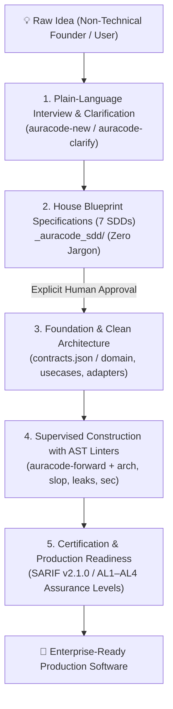

# AuraCode — Agentic Unified Reliability & Assurance Framework

> **AuraCode** (**A**gentic **U**nified **R**eliability & **A**ssurance for **Code**)  
> **Status: 0.1.1 (Beta / Community Preview) — AST Verification Engine, Lay-User AI Pair Programming & Governance Framework**  
> **Language Support:** Architectural principles and governance controls are language-agnostic. The automated AST inspection engine (`auracode`) currently targets **Python (3.9+)**.

[](README.pt-BR.md)
[](LICENSE)

A vendor-neutral, evidence-gated framework and active governance toolkit for building, auditing, and operating professional software developed with substantial assistance from large language models (LLMs) and autonomous coding agents—specifically designed to guide **lay/non-technical users** through building software from scratch or improving existing systems using academic software engineering best practices.

---

## 📖 Manifesto: AI Software Assurance & Lay-User Pair Programming

Artificial intelligence has fundamentally transformed software engineering. Large Language Models (LLMs) and autonomous coding agents can now interpret requirements, refactor systems, invoke tools, and generate thousands of lines of code in seconds. However, this velocity introduces critical risks when non-technical users interact with AI: hallucinated dependencies, silent assumptions, architectural erosion, superficial test suites (*vitiated oracles*), and *"AI slop"* (bloated code, forgotten stubs, and unnecessary abstractions).

AuraCode bridges this gap through **Zero-Trust AI Pair Programming for Non-Technical Users**:

> **AI Zero Trust & Zero Presumption:** Do not trust AI simply because the output looks plausible. AI must never silently guess requirements, interfaces, or technical trade-offs. Demand empirical evidence and explicit human authorization for every decision.

### Core Principles of AuraCode

1. **Zero-Presumption Directive (Tolerância Zero a Presunções):** The AI agent is strictly forbidden from inferring or deciding business rules, screen behaviors, data models, or error cases on its own. Every ambiguity—no matter how small—triggers a plain-language question to the user.
2. **House Blueprint First Paradigm (`_auracode_sdd/`):** Just like constructing a house, no application code, directories, or scripts are generated before the complete theoretical architecture (frontend, backend, database, security, APIs, design system, assurance level AL1-AL4) is fully specified and reviewed in 7 markdown blueprints under `_auracode_sdd/`.
3. **Plain-Language Dialogue & Analogies:** Complex technical trade-offs are translated into real-world analogies (e.g., Database $\rightarrow$ *"Smart Filing Cabinet"*, Backend $\rightarrow$ *"Restaurant Kitchen"*, API $\rightarrow$ *"Waiter taking orders"*, Frontend $\rightarrow$ *"Storefront counter"*, Authentication $\rightarrow$ *"ID Badge"*). Structured choice menus with simple pros and cons are provided whenever technical options arise.
4. **Native AST Static Analysis (`auracode <command>`):** Deterministic syntax analyzers inspect code for LLM anti-patterns without relying on LLMs to judge LLMs: hunts dead code and stubs (`auracode slop`), prevents resource leaks (`auracode leaks`), catches injection vectors (`auracode sec`), enforces strict type hints, and restricts diffs to under 500 lines to block uncontrolled rewrites.
5. **Progressive Assurance Levels (AL1 to AL4):** From low-risk local utilities (AL1) to mission-critical financial infrastructure (AL4), verification rigor scales proportionally with the impact of failure.

---

## 🏛️ From Idea to Production: The Senior-Grade Guided Journey

AuraCode transforms chaotic AI interaction (often marked by silent assumptions and hallucinated code—commonly termed *Vibe Coding*) into a disciplined, **Senior-Level Software Engineering Journey**. Any founder, product owner, or non-technical creator is guided from scratch to delivering a production-ready, enterprise-grade web application or software system.



### 1. The Analogy: The "Senior Chief Engineer" vs. The "Hasty Mason"
* **Conventional AI (*Vibe Coding*):** Acts like a hasty mason who immediately pours cement and lays bricks on bare soil without a foundation or plumbing blueprints. The structure might look nice on day one, but it cracks, leaks, and collapses under production traffic.
* **AuraCode (*Senior Pair Programming*):** Acts like a Senior Chief Engineer who sits down with you, designs the complete architectural blueprint in plain human terms, explains where each load-bearing column goes, and **strictly forbids laying a single brick** before you understand and approve the blueprint. During construction, every line of code is inspected with laser-precise AST linters.

---

### 2. The 4-Phase Production Scope of Work

#### 📋 Phase 1: Zero-Jargon Briefing & Clarification
* **Zero-Presumption Directive:** The AI is forbidden from guessing data models, screen behavior, or business rules.
* **Physical World Analogies:** Technical concepts are translated into daily physical terms (Database $\rightarrow$ *"Smart Filing Cabinet"*, Backend $\rightarrow$ *"Restaurant Kitchen"*, API $\rightarrow$ *"Order Waiter"*, Authentication $\rightarrow$ *"Building Badge"*).
* **Gate G1 Ambiguity Scanner:** The `auracode ambiguity` command scans requirements for vague phrasing (*"maybe"*, *"should work"*, *"standard way"*), enforcing absolute clarity.

#### 📐 Phase 2: The House Blueprint — 7 SDD Technical Blueprints (`_auracode_sdd/`)
No code is generated before explicit user sign-off on all 7 specification blueprints:
1. `01_visao_geral_e_negocio.md` — Core purpose and user-authorized features.
2. `02_arquitetura_e_componentes.md` — Structural rooms and internal flows (Clean Architecture).
3. `03_modelo_de_dados_e_armazenamento.md` — Data entities, schema, and persistence.
4. `04_seguranca_e_permissoes.md` — Access keys, roles, and authorization policies.
5. `05_apis_e_integracoes.md` — External gateways and message boundaries.
6. `06_interface_e_design_system.md` — Visual storefront, components, and interaction states.
7. `07_nivel_de_garantia_e_testes.md` — Required verification rigor (Assurance Levels AL1 to AL4).

#### 🏗️ Phase 3: Supervised Construction & Clean Architecture
Implementation (`auracode-forward`) is strictly governed by deterministic AST linters:
* **Hermetic Boundaries:** Clean Architecture layers (`domain/`, `usecases/`, `adapters/`, `infrastructure/`, `tests/`), validated by `auracode arch`.
* **Zero AI Slop:** `auracode slop` rejects empty stubs, dead code, and swallowed exceptions (`except: pass`).
* **Resource Leak Prevention:** `auracode leaks` enforces context managers (`with`) on files, sockets, and DB connections.
* **Supply Chain Guardrails:** `auracode deps` checks packages against official PyPI indexes before installation.
* **Surgical Diffs:** `auracode diff` limits churn to under 500 lines per cycle and blocks test tampering (*anti-reward hacking*).

#### 🛡️ Phase 4: Production Certification & Standards Compliance
* **OASIS SARIF v2.1.0 Integration:** Unified findings format ingested by GitHub Advanced Security, SonarQube, and VS Code.
* **Global Security Standards:** Control coverage mapped to NIST SSDF 1.1, OWASP LLM Top 10, CWE Top 25, and ISO 25010.
* **Non-Vacuous Test Suites:** `auracode tests` audits test ASTs to ensure assertions are semantic and meaningful (zero `assert True`).

---

### 3. Comparison: Conventional AI (Vibe Coding) vs. AuraCode

| Engineering Criterion | Conventional AI (*Vibe Coding*) | AuraCode (*Senior Pair Programming*) |
| :--- | :--- | :--- |
| **Project Kickoff** | Generates code immediately without understanding real scope | Structured interview and 7-part SDD Blueprint sign-off |
| **Missing Requirements** | AI guesses silently and makes unverified architectural choices | **Zero Presumption:** AI pauses and provides structured options with analogies |
| **Code Architecture** | Spaghetti code mixing DB, business logic, and UI in single files | **Clean Architecture** with inward dependency AST contracts (`contracts.json`) |
| **Error Handling** | Errors swallowed with empty `try/catch` or `except: pass` | **Fail-Closed:** AST linters block dead code and silent swallows (`auracode slop`) |
| **Dependencies** | Frequent package hallucinations and supply chain vulnerabilities | Cryptographic verification against official package registries (`auracode deps`) |
| **Test Suite Quality** | Tautological or fake tests (`assert True`) that test nothing | AST Visitor (`auracode tests`) enforces semantic asserts and blocks tampering |
| **Production Readiness** | Heavy technical debt requiring total rewrite by senior engineers | **Enterprise Ready:** Modular, auditable, and certified software (AL1–AL4) |

---

## 🚀 Quick Start & Installation

### Option 1: Instant Execution via `uvx` (No installation needed, like `npx`)

Run any AuraCode command directly in an isolated environment without manual setup or cloning:

```bash
# Scan current project for AI slop and swallowed exceptions
uvx --from git+https://github.com/Maferreira25/Aura-Code.git auracode slop .

# Scan for injection vulnerabilities and shell risks
uvx --from git+https://github.com/Maferreira25/Aura-Code.git auracode sec .

# Start the stdio MCP server for Antigravity IDE / Cursor / Claude Desktop
uvx --from git+https://github.com/Maferreira25/Aura-Code.git auracode mcp
```

### Option 2: Local Installation via `pip`

Install AuraCode into your Python environment:

```bash
git clone https://github.com/Maferreira25/Aura-Code.git
cd Aura-Code
pip install -e .
```

Verify installation:
```bash
auracode --help
```

---

## 🛠️ Integrated AST Verification Suite (`auracode <command>`)

AuraCode provides 12 static AST and governance commands:

```bash
# 1. Initialize workspace directories (.auracode, _auracode_*)
auracode init

# 2. Evaluate requirement ambiguity & non-technical questions (Gate G1)
auracode ambiguity .

# 3. Scan Python AST for dead code, unreachable code, and swallowed errors
auracode slop .

# 4. Scan Python AST for unclosed resource leaks (file handles, sockets, DBs)
auracode leaks .

# 5. Scan Python AST for strict type hints and unconstrained 'Any' usage
auracode types .

# 6. Scan test suite integrity and detect vacuous tests lacking assertions
auracode tests .

# 7. Scan Python AST for injection vectors (eval/exec, shell=True, SQLi)
auracode sec .

# 8. Verify Clean Architecture layer boundaries using AST
auracode arch .

# 9. Verify dependencies against PyPI to prevent hallucinated packages
auracode deps .

# 10. Verify that repository changes are surgical and bounded (< 500 lines churn)
auracode diff .

# 11. Assess project against an Assurance Level (AL1-AL4)
auracode assess assessment.json

# 12. Start stdio Model Context Protocol (MCP) server for IDE integration
auracode mcp
```

---

## 🤖 AuraCode Active Skills & Persona Swarms (`.agents/skills/`)

AuraCode defines 9 primary IDE skills enforcing non-technical dialogue protocols and strict evidence scales:

1. **`auracode`**: Main framework entry point and command navigator.
2. **`auracode-new`**: Greenfield project workflow conducting plain-language interviews and generating the 7-part House Blueprint in `_auracode_sdd/`.
3. **`auracode-clarify`**: Non-technical requirement dialogue generator with zero presumptions and analogy menus.
4. **`auracode-brainstorm`**: Ideation and scope framing agent translating raw user concepts into plain-language feature menus.
5. **`auracode-forward`**: Spec-driven execution agent implementing Clean Architecture code (`domain/`, `usecases/`, `adapters/`, `infrastructure/`, `tests/`) strictly from approved blueprints.
6. **`auracode-audit`**: Autonomous QA runner executing the full 12-part `auracode` static analysis suite.
7. **`auracode-debugger`**: Bug investigator reproducing failures via failing unit tests first before applying minimal surgical fixes.
8. **`auracode-refactor`**: Quality specialist eliminating slop, unclosed resources, and missing type hints without altering public APIs.
9. **`auracode-agents-help`**: Explanatory catalog detailing the specialized agent personas using plain-language analogies.

---

## 📜 License & Governance
Licensed under the MIT License.

