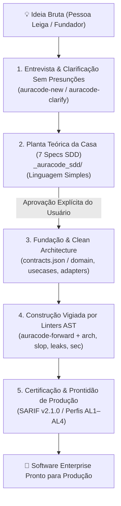

# AuraCode — Framework Agêntico de Garantia e Confiabilidade de Software

> **AuraCode** (**A**gentic **U**nified **R**eliability & **A**ssurance for **Code**)  
> **Status: 0.1.1 (Beta / Prévia da Comunidade) — Motor de Verificação AST, Pair Programming com Leigos e Governança**  
> **Suporte a Linguagens:** Princípios arquiteturais e controles de governança são agnósticos de linguagem. O motor automatizado de análise estática AST (`auracode`) atualmente inspeciona código **Python (3.9+)**.

[](README.md)
[](LICENSE)

Um framework neutro e baseado em evidências para construção, auditoria e operação de software profissional desenvolvido com auxílio de modelos de linguagem (LLMs) e agentes de codificação autônomos — especialmente projetado para guiar **pessoas leigas no mundo da tecnologia** a desenvolver um sistema desde o início ou melhorar um existente usando as melhores práticas de engenharia de software.

---

## 📖 Manifesto: Garantia de Software e Pair Programming com Leigos

A inteligência artificial transformou profundamente a engenharia de software. Modelos de linguagem e agentes autônomos já interpretam requisitos, refatoram sistemas, operam ferramentas e geram milhares de linhas de código em segundos. Contudo, essa velocidade introduz riscos críticos quando pessoas leigas interagem com a IA: dependências alucinadas, presunções silenciosas, erosão arquitetural, testes superficiais (*oráculos viciados*) e o chamado *"AI slop"* (código inflado, stubs esquecidos e abstrações desnecessárias).

O AuraCode resolve essa lacuna através do **Pair Programming Agêntico com Tolerância Zero a Presunções**:

> **AI Zero Trust & Zero Presunções:** Não confie na IA apenas porque a resposta parece plausível. A IA está estritamente proibida de presumir ou decidir regras de negócio, telas ou arquiteturas em segredo. Exija evidências empíricas e aprovação humana explícita para cada decisão.

### Princípios Fundamentais do AuraCode

1. **Diretriz de Tolerância Zero a Presunções:** A IA não pode inferir ou decidir nada silenciosamente. Qualquer incerteza ou lacuna — por menor que seja — gera uma pergunta em linguagem simples ao usuário.
2. **Paradigma da Planta da Casa (`_auracode_sdd/`):** Tal como a construção de uma casa, nenhuma linha de código de aplicação, pasta ou script é gerado antes que toda a arquitetura teórica (frontend, backend, banco de dados, segurança, APIs, design system e níveis de garantia AL1-AL4) esteja 100% especificada e revisada em 7 documentos markdown no diretório `_auracode_sdd/`.
3. **Comunicação Didática e Analogias:** Decisões técnicas são traduzidas em comparações cotidianas (ex.: Banco de Dados $\rightarrow$ *"Armário Inteligente"*, Backend $\rightarrow$ *"Cozinha do Restaurante"*, API $\rightarrow$ *"Garçom de Mensagens"*, Frontend $\rightarrow$ *"Balcão e Vitrine"*, Autenticação $\rightarrow$ *"Crachá de Acesso"*). Escolhas técnicas são apresentadas em menus com prós e contras simples.
4. **Motor de Análise Estática Nativo (`auracode <comando>`):** Analisadores sintáticos determinísticos inspecionam o código em busca de vícios típicos de LLMs: caçam código morto (`auracode slop`), detectam vazamentos de arquivos (`auracode leaks`), verificam injeções (`auracode sec`), exigem tipagem estrita e limitam diffs a menos de 500 linhas.
5. **Níveis Progressivos de Garantia (AL1 a AL4):** Do protótipo local (AL1) ao sistema crítico (AL4), o rigor dos controles escala proporcionalmente ao impacto de uma falha.

---

## 🏛️ Da Ideia à Produção: O Escopo de Trabalho de Nível Sênior

O Aura Code transforma a interação com agentes de IA (que costuma ser desordenada e cheia de presunções silenciosas — o chamado *Vibe Coding*) em um processo disciplinado de **Engenharia de Software de Nível Sênior**. Qualquer pessoa — mesmo sem experiência prévia em programação — é guiada do zero até a entrega de um sistema web ou aplicação profissional pronta para produção.



### 1. A Analogia: O "Engenheiro-Chefe Sênior" vs. O "Pedreiro Apressado"
* **A IA Convencional (*Vibe Coding*):** Age como um pedreiro apressado que começa a assentar tijolos no chão de terra sem fundação ou planta hidráulica. O resultado parece bonito à primeira vista, mas racha e quebra no primeiro teste de carga.
* **O Aura Code (*Pair Programming Sênior*):** Age como um Engenheiro-Chefe que senta com você, desenha a planta baixa completa em linguagem simples, explica onde ficará cada pilar e **não permite colocar um único tijolo** antes de você entender e assinar a planta. Durante a obra, fiscaliza cada cano e viga com nível a laser (*Linters AST determinísticos*).

---

### 2. O Escopo de Trabalho em 4 Fases Estruturadas

#### 📋 Fase 1: Concepção & Clarificação Sem Jargões
* **Tolerância Zero a Presunções:** A IA é proibida de adivinhar comportamentos de tela, bancos de dados ou regras de negócio.
* **Analogias Físicas Cotidianas:** Tradução sistemática de termos difíceis (Banco de Dados $\rightarrow$ *"Armário de Fichas"*, Backend $\rightarrow$ *"Cozinha do Restaurante"*, API $\rightarrow$ *"Garçom de Pedidos"*, Autenticação $\rightarrow$ *"Crachá de Acesso"*).
* **Gate G1 de Ambiguidade:** O comando `auracode ambiguity` varre os requisitos em busca de termos vagos (*"talvez"*, *"deve funcionar"*, *"comportamento padrão"*), garantindo clareza total.

#### 📐 Fase 2: A Planta da Casa — Os 7 Cadernos Técnicos SDD (`_auracode_sdd/`)
Nenhuma linha de código é gerada antes da aprovação explícita dos 7 documentos de especificação:
1. `01_visao_geral_e_negocio.md` — Propósito da aplicação e funcionalidades confirmadas pelo usuário.
2. `02_arquitetura_e_componentes.md` — As divisões e fluxos internos do sistema (Clean Architecture).
3. `03_modelo_de_dados_e_armazenamento.md` — O formato exato das informações e histórico.
4. `04_seguranca_e_permissoes.md` — Quem tem a chave de cada recurso (perfis e acessos).
5. `05_apis_e_integracoes.md` — As portas de comunicação com o mundo externo.
6. `06_interface_e_design_system.md` — A vitrine visual, telas e usabilidade.
7. `07_nivel_de_garantia_e_testes.md` — O rigor dos testes exigido (Níveis AL1 a AL4).

#### 🏗️ Fase 3: Construção Vigiada & Limites Limpos (Clean Architecture)
A implementação do código executável (`auracode-forward`) é restrita e monitorada pelos verificadores AST:
* **Fronteiras Herméticas:** Estruturação estrita em camadas (`domain/`, `usecases/`, `adapters/`, `infrastructure/`, `tests/`), verificadas continuamente por `auracode arch`.
* **Zero AI Slop:** O comando `auracode slop` barra stubs vazios, código morto e exceções engolidas (`except: pass`).
* **Proteção contra Vazamentos:** O comando `auracode leaks` exige context managers (`with`) em conexões e arquivos.
* **Anti-Alucinação:** O comando `auracode deps` cruza pacotes solicitados com o registro oficial antes de permitir a instalação.
* **Diffs Cirúrgicos:** O comando `auracode diff` restringe alterações a menos de 500 linhas por ciclo e bloqueia adulterações de testes (*anti-reward hacking*).

#### 🛡️ Fase 4: Certificação e Prontidão de Produção
* **Integração SARIF v2.1.0:** Consolidação de achados compatível com GitHub Advanced Security, SonarQube e VS Code.
* **Alinhamento com Normas Globais:** Cobertura de controles baseados em NIST SSDF 1.1, OWASP LLM Top 10 e CWE Top 25.
* **Testes Sem Vacuidade:** O comando `auracode tests` audita o AST da suíte para garantir asserções semânticas reais (zero `assert True`).

---

### 3. Comparativo: IA Convencional (Vibe Coding) vs. Aura Code

| Critério de Engenharia | Desenvolvimento com IA Comum (*Vibe Coding*) | Desenvolvimento com Aura Code (*Senior Pair Programming*) |
| :--- | :--- | :--- |
| **Início do Projeto** | Gera código imediatamente sem entender o escopo real | Entrevista em linguagem simples e aprovação da Planta SDD em 7 cadernos |
| **Regras não informadas** | A IA adivinha e toma decisões arquiteturais silenciosas | **Zero Presunção:** IA pausa e apresenta opções claras com analogias |
| **Organização do Código** | Código espaguete misturando banco, lógica e tela em 1 arquivo | **Clean Architecture** em camadas isoladas com contratos AST (`contracts.json`) |
| **Tratamento de Erros** | Erros silenciados com `try { ... } catch {}` vazios | **Fail-Closed:** Linters AST barram código morto e swallows (`auracode slop`) |
| **Dependências Externas** | Alucinação frequente de bibliotecas inexistentes (*slopsquatting*) | Verificação formal contra registros oficiais (`auracode deps`) |
| **Integridade dos Testes** | Testes superficiais ou tautológicos (`assert True`) que não testam nada | AST Visitor (`auracode tests`) exige asserções reais e bloqueia adulteração |
| **Prontidão de Produção** | Dívida técnica severa que exige reescrita por desenvolvedores sêniores | **Enterprise Ready:** Software auditável, modular e certificado (AL1–AL4) |

---

## 🚀 Instalação e Início Rápido

### Opção 1: Execução Instantânea via `uvx` (Sem necessidade de instalação, estilo `npx`)

Execute qualquer comando do AuraCode diretamente em um ambiente temporário isolado, sem precisar clonar o repositório ou configurar ambientes virtuais:

```bash
# Escanear projeto atual para AI slop e exceções silenciadas
uvx --from git+https://github.com/Maferreira25/Aura-Code.git auracode slop .

# Escanear vulnerabilidades de injeção e riscos com shell=True
uvx --from git+https://github.com/Maferreira25/Aura-Code.git auracode sec .

# Iniciar o servidor MCP para Antigravity IDE / Cursor / Claude Desktop
uvx --from git+https://github.com/Maferreira25/Aura-Code.git auracode mcp
```

### Opção 2: Instalação Local via `pip`

Clone e instale o pacote no seu ambiente Python:

```bash
git clone https://github.com/Maferreira25/Aura-Code.git
cd Aura-Code
pip install -e .
```

Verifique a instalação:
```bash
auracode --help
```

---

## 🛠️ Suíte Integrada de Verificação AST (`auracode <comando>`)

O AuraCode oferece 12 comandos nativos de verificação estática e governança:

```bash
# 1. Inicializar diretórios locais de trabalho (.auracode, _auracode_*)
auracode init

# 2. Avaliar ambiguidade de requisitos e gerar perguntas não técnicas (Gate G1)
auracode ambiguity .

# 3. Escanear AST para dead code, código inalcançável e erros silenciosos
auracode slop .

# 4. Escanear AST para vazamento de recursos (arquivos, DBs, sockets sem 'with')
auracode leaks .

# 5. Escanear AST para anotações estritas de tipo e proibir o uso de 'Any'
auracode types .

# 6. Analisar integridade da suíte de testes e detectar testes sem asserções
auracode tests .

# 7. Escanear AST para vetores de injeção (eval/exec, shell=True, SQLi)
auracode sec .

# 8. Verificar limites de Clean Architecture via AST
auracode arch .

# 9. Verificar dependências contra o PyPI para evitar alucinações de pacotes
auracode deps .

# 10. Verificar se as alterações do repositório são cirúrgicas (churn < 500 linhas)
auracode diff .

# 11. Avaliar projeto contra um Nível de Garantia (AL1-AL4)
auracode assess assessment.json

# 12. Iniciar servidor stdio Model Context Protocol (MCP) para integração IDE
auracode mcp
```

---

## 🤖 Habilidades Ativas e Enxames de Agentes (`.agents/skills/`)

O AuraCode oferece 9 habilidades principais para IDEs com protocolos de comunicação em linguagem simples:

1. **`auracode`**: Ponto de entrada do framework e menu de navegação.
2. **`auracode-new`**: Fluxo de novos projetos conduzindo briefing não-técnico e gerando a Planta Teórica de 7 partes em `_auracode_sdd/`.
3. **`auracode-clarify`**: Agente anti-presunção gerando perguntas em linguagem simples com menus de comparação cotidianos.
4. **`auracode-brainstorm`**: Ideação e definição de escopo traduzindo conceitos do usuário em menus de funcionalidades.
5. **`auracode-forward`**: Execução orientada a especificação implementando Clean Architecture (`domain/`, `usecases/`, `adapters/`, `infrastructure/`, `tests/`) estritamente a partir da planta aprovada.
6. **`auracode-audit`**: QA autônomo executando a suíte de 12 verificações estáticas `auracode`.
7. **`auracode-debugger`**: Investigador de defeitos que gera testes falhos antes da correção cirúrgica.
8. **`auracode-refactor`**: Especialista em eliminação de slop e otimização sem alterar comportamento de negócio.
9. **`auracode-agents-help`**: Catálogo explicativo dos agentes com analogias didáticas.

---

## 📜 Licença
Licenciado sob a Licença MIT.

