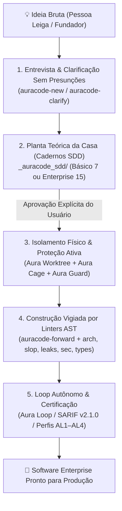

# AuraCode — Framework Agêntico de Garantia e Confiabilidade de Software

> **AuraCode** (**A**gentic **U**nified **R**eliability & **A**ssurance for **Code**)  
> **Status: 0.3.0 (Estável / Modernização Estratégica V2.0) — Motor de Verificação AST, Isolamento Ativo de Agentes, DevContainers Herméticos, Perfis Graduados de SDD, Testes de Mutação AST, Scanner Multi-Linguagem, Assistente TUI para Leigos e Debates Agênticos**  
> **Suporte a Linguagens:** Princípios arquiteturais, isolamento de contêineres e governança são agnósticos de linguagem. O motor unificado de análise sintática (`auracode multilang`) inspeciona nativamente código em **Python, TypeScript, JavaScript, Go, Java e C#**.

[](README.md)
[](LICENSE)
[-brightgreen.svg)](tests/)
[](tools/)

Um framework neutro e baseado em evidências para construção, auditoria e operação de software profissional desenvolvido com auxílio de modelos de linguagem (LLMs) e agentes de codificação autônomos — especialmente projetado para guiar **pessoas leigas no mundo da tecnologia** a desenvolver um sistema desde o início ou modernizar um existente usando as melhores práticas de engenharia de software de nível sênior.

---

## 📖 Manifesto: Garantia de Software e Pair Programming com Leigos

A inteligência artificial transformou profundamente a engenharia de software. Modelos de linguagem e agentes autônomos já interpretam requisitos, refatoram sistemas, operam ferramentas e geram milhares de linhas de código em segundos. Contudo, essa velocidade introduz riscos críticos quando pessoas leigas interagem com a IA: dependências alucinadas, presunções silenciosas, erosão arquitetural, testes superficiais (*oráculos viciados*), vulnerabilidades a injeção de prompt indireta e o chamado *"AI slop"* (código inflado, stubs esquecidos e abstrações desnecessárias).

O AuraCode resolve essa lacuna através do **Pair Programming Agêntico com Tolerância Zero a Presunções**:

> **AI Zero Trust & Zero Presunções:** Não confie na IA apenas porque a resposta parece plausível. A IA está estritamente proibida de presumir ou decidir regras de negócio, telas ou arquiteturas em segredo. Exija evidências empíricas e aprovação humana explícita para cada decisão.

### Princípios Fundamentais do AuraCode

1. **Diretriz de Tolerância Zero a Presunções:** A IA não pode inferir ou decidir nada silenciosamente. Qualquer incerteza ou lacuna — por menor que seja — gera uma pergunta em linguagem simples ao usuário.
2. **Paradigma da Planta da Casa (`_auracode_sdd/`):** Tal como a construção de uma casa, nenhuma linha de código de aplicação, pasta ou script é gerado antes que toda a arquitetura teórica (frontend, backend, banco de dados, segurança, APIs, design system e níveis de garantia AL1-AL4) esteja 100% especificada e revisada em cadernos markdown no diretório `_auracode_sdd/` (4 perfis graduados: `micro` [1 spec], `lite` [3 specs], `standard` [7 specs] ou `enterprise` [15 specs]).
3. **Comunicação Didática e Analogias Físicas:** Decisões técnicas são traduzidas em comparações cotidianas (ex.: Banco de Dados $\rightarrow$ *"Armário Inteligente"*, Backend $\rightarrow$ *"Cozinha do Restaurante"*, API $\rightarrow$ *"Garçom de Mensagens"*, Frontend $\rightarrow$ *"Balcão e Vitrine"*, Autenticação $\rightarrow$ *"Crachá de Acesso"*). Escolhas técnicas são apresentadas em menus estruturados com prós e contras simples.
4. **Contenção Ativa e Ambientes Isolados:** O agente não pode sujar a branch principal de trabalho do desenvolvedor, disparar comandos operacionais perigosos ou trafegar dados livremente pela internet. O AuraCode impõe isolamento físico com Git Worktrees, interceptação fail-closed de hooks e DevContainers herméticos com firewall Default-Deny.
5. **Motor de Análise Estática Nativo & Testes de Mutação AST (`auracode <comando>`):** Analisadores sintáticos determinísticos inspecionam o código em busca de vícios típicos de LLMs: caçam código morto (`auracode slop`), detectam vazamentos de arquivos (`auracode leaks`), verificam injeções (`auracode sec`), exigem tipagem estrita (`auracode types`), isolam camadas Clean Architecture (`auracode arch`), inspecionam projetos multi-linguagem (`auracode multilang`), executam mutação sintática leve para liquidar testes viciados/falsos (`auracode tests --mutate`), e restringem diffs a menos de 500 linhas bloqueando adulteração de testes (`auracode diff`).
6. **Níveis Progressivos de Garantia (AL1 a AL4):** Do protótipo local (AL1) ao sistema crítico financeiro (AL4), o rigor dos controles escala proporcionalmente ao impacto de uma falha.

---

## 🛡️ Os 5 Pilares da Modernização V2.0

Com base nos princípios de engenharia consolidados no livro [*Engenharia de Software com Agentes Inteligentes*](RESUMO_ENGENHARIA_SOFTWARE_AGENTES_INTELIGENTES.md), o AuraCode V2.0 introduz 5 frentes estruturais fundamentais para a confiabilidade de agentes de IA:

```
┌─────────────────────────────────────────────────────────────────────────────────────────┐
│                                PILARES AURACODE V2.0                                    │
├──────────────────────────┬─────────────────────────────┬────────────────────────────────┤
│      1. AURA GUARD       │       2. AURA WORKTREE      │       3. SDD ENTERPRISE        │
│ Interceptação ativa via  │ Isolamento físico de branches│ 15 cadernos técnicos cobrindo  │
│ hooks pre/post-tool para │ evitando que agentes sujem  │ compliance, telemetria, DR,    │
│ bloquear OS e exfiltração│ a branch do desenvolvedor   │ modelagem de ameaças e APIs    │
├──────────────────────────┴─────────────────────────────┴────────────────────────────────┤
│      4. AURA CAGE                                      │ 5. AURA LOOP                   │
│ DevContainers herméticos com firewall Default-Deny     │ Runner autônomo baseado na     │
│ que neutraliza ataques de prompt injection indireto    │ Arquitetura Ralph com 5 gates  │
└────────────────────────────────────────────────────────┴────────────────────────────────┘
```

### 1. Aura Guard: Interceptação Ativa de Execução (`auracode guard`)
- Intercepta chamadas de ferramentas antes do despacho ao sistema operacional através de `.agents/hooks.json` e `tools/pre_tool_guard.py`.
- **Proteção Fail-Closed:** Bloqueia comandos destrutivos no terminal (`rm -rf /`, `rmdir /s /q C:\`, formatação de disco, `dd`, `git reset --hard HEAD~10`).
- **Bloqueio de Vazamento de Segredos:** Impede comandos que tentam enviar tokens de ambiente, chaves privadas SSH (`id_rsa`) ou credenciais para servidores externos via `curl`, `wget` ou `nc`.
- Configuração rápida: `auracode guard install .` ou verificação manual: `auracode guard check --tool run_command --cmd "rm -rf /"`.

### 2. Aura Worktree: Isolamento Físico de Branches (`auracode worktree`)
- Elimina o problema clássico de "árvore suja de trabalho" isolando cada sessão do agente em uma pasta física paralela do Git em `.auracode/worktrees/<task>`.
- A branch ativa do desenvolvedor e arquivos não commitados permanecem 100% limpos e protegidos.
- Comandos:
  - `auracode worktree create --task auth-feature`
  - `auracode worktree list`
  - `auracode worktree merge --task auth-feature`
  - `auracode worktree clean --task auth-feature`

### 3. SDD Enterprise: 15 Cadernos Técnicos Modulares (`auracode init --profile enterprise`)
- Expande a Planta da Casa básica de 7 cadernos para 15 especificações detalhadas de nível corporativo:
  1. `01_visao_geral_e_negocio.md` — Visão do produto e funcionalidades aprovadas pelo usuário.
  2. `02_arquitetura_e_componentes.md` — Limites de Clean Architecture e separação de camadas.
  3. `03_modelo_de_dados_e_armazenamento.md` — Estrutura de dados, mapeamento e persistência.
  4. `04_seguranca_e_permissoes.md` — Perfis de acesso, RBAC, criptografia e fronteiras de autenticação.
  5. `05_apis_e_integracoes.md` — Contratos de entrada e saída, webhooks e gateways.
  6. `06_interface_e_design_system.md` — Vitrine visual, componentes visuais e estados de tela.
  7. `07_nivel_de_garantia_e_testes.md` — Metas de Garantia (AL1–AL4) e pirâmide de testes.
  8. `08_observabilidade_e_telemetria.md` — Rastreamento distribuído, métricas e endpoints de saúde.
  9. `09_conformidade_e_privacidade.md` — Adequação a LGPD/GDPR, retenção de dados e anonimização.
  10. `10_resiliencia_e_recuperacao.md` — Plano de desastres, circuit breakers e metas RTO/RPO.
  11. `11_modelo_de_ameacas.md` — Modelagem STRIDE, vetores de ataque e contramedidas.
  12. `12_escalabilidade_e_cache.md` — Regras de escalabilidade horizontal e invalidação de cache.
  13. `13_integracoes_externas.md` — SLAs de parceiros, tempos limites de rede (timeouts) e fallbacks.
  14. `14_migracao_e_legado.md` — Versionamento de banco de dados, rollbacks e pontes com sistemas antigos.
  15. `15_implantacao_e_rollout.md` — Estratégia blue/green, canários e critérios de rollback.

### 4. Aura Cage: Sandbox DevContainer com Firewall Default-Deny (`auracode cage`)
- Neutraliza o maior vetor de risco de agentes em modo autônomo / "YOLO": a exfiltração de dados por injeção de prompt indireta.
- Constrói um DevContainer Linux com `iptables` configurado em política estrita de **Default-Deny**.
- Todo tráfego de saída é bloqueado por padrão; apenas domínios explicitamente homologados (como PyPI, GitHub e APIs internas em `allowed-domains.txt`) são liberados.
- Comandos:
  - `auracode cage init .`
  - `auracode cage verify`

### 5. Aura Loop: Runner Autônomo sob Arquitetura Ralph (`auracode loop`)
- Implementa o padrão de runner autônomo stateless inspirado na Ralph Architecture (Geoffrey Huntley).
- **Anti-Dumb-Zone:** Combate a degradação cognitiva e alucinação que ocorre quando o contexto do LLM ultrapassa 100 mil tokens, executando cada iteração com contexto novo guiado pelo estado do disco.
- **Anti-Reward-Hacking:** Exige aprovação sequencial em 5 níveis de verificação (Compilação $\rightarrow$ Linters AST $\rightarrow$ Testes Unitários $\rightarrow$ Asserções Semânticas $\rightarrow$ Checagem de Segurança). Tentativas do agente de apagar testes ou afrouxar asserções são rejeitadas.
- **Freio de Emergência:** Interrompe a execução caso ocorram 3 falhas consecutivas, prevenindo loops de queima inútil de tokens.
- Comandos:
  - `auracode loop run --max-turns 10`
  - `auracode loop status`
  - `auracode loop reset`

---

## 🏛️ Da Ideia à Produção: O Escopo de Trabalho de Nível Sênior

O Aura Code transforma a interação com agentes de IA (que costuma ser desordenada e cheia de presunções silenciosas — o chamado *Vibe Coding*) em um processo disciplinado de **Engenharia de Software de Nível Sênior**. Qualquer pessoa — mesmo sem experiência prévia em programação — é guiada do zero até a entrega de um sistema web ou aplicação profissional pronta para produção.



### 1. A Analogia: O "Engenheiro-Chefe Sênior" vs. O "Pedreiro Apressado"
* **A IA Convencional (*Vibe Coding*):** Age como um pedreiro apressado que começa a assentar tijolos no chão de terra sem fundação ou planta hidráulica. O resultado parece bonito à primeira vista, mas racha e quebra no primeiro teste de carga.
* **O Aura Code (*Pair Programming Sênior*):** Age como um Engenheiro-Chefe que senta com você, desenha a planta baixa completa em linguagem simples, explica onde ficará cada pilar e **não permite colocar um único tijolo** antes de você entender e assinar a planta. Durante a obra, fiscaliza cada cano e viga com nível a laser (*Linters AST determinísticos*), isola o canteiro em worktrees seguros e protege o ambiente com firewalls em tempo real.

---

### 2. O Escopo de Trabalho em 5 Fases Estruturadas

#### 📋 Fase 1: Concepção & Clarificação Sem Jargões
* **Tolerância Zero a Presunções:** A IA é proibida de adivinhar comportamentos de tela, bancos de dados ou regras de negócio.
* **Analogias Físicas Cotidianas:** Tradução sistemática de termos difíceis (Banco de Dados $\rightarrow$ *"Armário de Fichas"*, Backend $\rightarrow$ *"Cozinha do Restaurante"*, API $\rightarrow$ *"Garçom de Pedidos"*, Autenticação $\rightarrow$ *"Crachá de Acesso"*).
* **Gate G1 de Ambiguidade:** O comando `auracode ambiguity` varre os requisitos em busca de termos vagos (*"talvez"*, *"deve funcionar"*, *"comportamento padrão"*), garantindo clareza total.

#### 📐 Fase 2: A Planta da Casa — Cadernos Técnicos SDD (`_auracode_sdd/`)
Nenhuma linha de código é gerada antes da aprovação explícita dos cadernos de especificação:
* **Perfil Micro (`--profile micro`):** 1 especificação concisa (`01_task_spec.md`) para scripts utilitários rápidos e pequenas correções (AL1).
* **Perfil Lite (`--profile lite`):** 3 cadernos essenciais (Visão & Regras, Arquitetura & Dados, Testes & Critérios) para MVPs e validação (AL2).
* **Perfil Standard (`--profile standard` ou `--profile basic`):** 7 cadernos arquiteturais completos para sistemas web e corporativos (AL3).
* **Perfil Enterprise (`--profile enterprise`):** 15 cadernos aprofundados para sistemas de missão crítica, regulados ou de grande escala (AL4).

#### 🔒 Fase 3: Ambiente de Execução Isolado e Seguro
* **Aura Worktree:** Cria uma pasta isolada para a tarefa do agente (`.auracode/worktrees/<task>`), protegendo os arquivos locais do desenvolvedor.
* **Aura Cage:** Gera um DevContainer hermético com firewall Default-Deny para barrar exfiltração de dados e injeção de prompt.
* **Aura Guard:** Ativa hooks de pre-tool que barram comandos destrutivos no terminal e roubo de segredos em tempo real.

#### 🏗️ Fase 4: Construção Vigiada & Limites Limpos (Clean Architecture)
A implementação do código executável (`auracode-forward`) é restrita e monitorada pelos verificadores AST:
* **Fronteiras Herméticas:** Estruturação estrita em camadas (`domain/`, `usecases/`, `adapters/`, `infrastructure/`, `tests/`), verificadas continuamente por `auracode arch`.
* **Zero AI Slop:** O comando `auracode slop` barra stubs vazios, código morto e exceções engolidas (`except: pass`).
* **Proteção contra Vazamentos:** O comando `auracode leaks` exige context managers (`with`) em conexões e arquivos.
* **Tipagem Estrita:** O comando `auracode types` exige assinaturas tipadas e proíbe uso descuidado de `Any`.
* **Segurança contra Injeção:** O comando `auracode sec` barra `eval`, `exec`, concatenação SQL e `shell=True`.
* **Anti-Alucinação:** O comando `auracode deps` cruza pacotes solicitados com o registro oficial PyPI antes da instalação.
* **Diffs Cirúrgicos:** O comando `auracode diff` restringe alterações a menos de 500 linhas por ciclo e bloqueia adulterações de testes (*anti-reward hacking*).

#### 🛡️ Fase 5: Execução em Loop Autônomo e Certificação de Produção
* **Aura Loop:** Ciclos autônomos sob a Arquitetura Ralph com reset de contexto para prevenir cansaço e perda de foco do modelo.
* **Integração SARIF v2.1.0:** Consolidação de achados compatível com GitHub Advanced Security, SonarQube e VS Code.
* **Alinhamento com Normas Globais:** Cobertura de controles baseados em NIST SSDF 1.1, OWASP LLM Top 10 e CWE Top 25.
* **Testes Sem Vacuidade:** O comando `auracode tests` audita o AST da suíte para garantir asserções semânticas reais (zero `assert True`).

---

### 3. Comparativo: IA Convencional (Vibe Coding) vs. Aura Code

| Critério de Engenharia | Desenvolvimento com IA Comum (*Vibe Coding*) | Desenvolvimento com Aura Code (*Senior Pair Programming*) |
| :--- | :--- | :--- |
| **Início do Projeto** | Gera código imediatamente sem entender o escopo real | Entrevista em linguagem simples e aprovação da Planta SDD (Básico 7 ou Enterprise 15) |
| **Regras não informadas** | A IA adivinha e toma decisões arquiteturais silenciosas | **Zero Presunção:** IA pausa e apresenta opções claras com analogias |
| **Organização do Código** | Código espaguete misturando banco, lógica e tela em 1 arquivo | **Clean Architecture** em camadas isoladas com contratos AST (`contracts.json`) |
| **Espaço de Trabalho** | Árvore de trabalho suja, conflitos e arquivos não commitados | **Aura Worktree:** Isolamento físico em diretórios paralelos dedicados |
| **Segurança Operacional** | Dispara comandos destrutivos (`rm -rf`, format) cegamente | **Aura Guard:** Interceptação ativa fail-closed protegendo o sistema |
| **Rede e Exfiltração** | Acesso livre à internet vulnerável a prompt injection indireto | **Aura Cage:** DevContainer hermético com firewall Default-Deny via iptables |
| **Tratamento de Erros** | Erros silenciados com `try { ... } catch {}` ou `except: pass` | **Fail-Closed:** Linters AST barram código morto e swallows (`auracode slop`) |
| **Execução Autônoma** | Degradação após 100k tokens (Dumb Zone) e loops infinitos | **Aura Loop:** Runner stateless da Arquitetura Ralph com 5 gates AST |
| **Dependências Externas** | Alucinação frequente de bibliotecas inexistentes (*slopsquatting*) | Verificação formal contra registros oficiais (`auracode deps`) |
| **Integridade dos Testes** | Testes superficiais ou tautológicos (`assert True`) que não testam nada | AST Visitor (`auracode tests`) exige asserções reais e bloqueia adulteração |
| **Prontidão de Produção** | Dívida técnica severa que exige reescrita por desenvolvedores sêniores | **Enterprise Ready:** Software auditável, modular e certificado (AL1–AL4) |

---

## 🚀 Como Instalar e Usar no Seu Projeto (Guia Simples para Pessoas Leigas)

Você não precisa ser especialista em tecnologia ou programação para usar o AuraCode. O framework foi desenhado exatamente para guiar quem está começando ou quem gerencia projetos de software com IAs.

Siga os passos simples abaixo:

---

### Passo 0: O Único Pré-Requisito (Verificar o Python)
O AuraCode precisa apenas do **Python** instalado no seu computador (versão 3.9 ou superior).

Para testar, abra o terminal (Prompt de Comando, PowerShell ou Terminal do macOS/Linux) e digite:
```bash
python --version
```
- Se aparecer `Python 3.9` (ou qualquer versão superior, como 3.10, 3.11, 3.12 ou 3.13), você já está pronto!
- Se não estiver instalado ou aparecer erro, baixe gratuitamente o instalador oficial em: **[python.org/downloads](https://www.python.org/downloads/)** *(no Windows, lembre-se de marcar a caixinha "Add Python to PATH" durante a instalação)*.

---

### Passo 1: Instalar o AuraCode no seu Computador (1 Comando Único)
Abra o terminal em qualquer pasta e digite o comando abaixo para instalar o AuraCode no seu computador:

```bash
pip install git+https://github.com/Maferreira25/Aura-Code.git
```

Para conferir se deu tudo certo:
```bash
auracode --help
```
*Pronto! O comando `auracode` agora está disponível globalmente em qualquer pasta da sua máquina.*

> 💡 **Dica para Usuários Avançados (Execução Instantânea sem Instalação):**  
> Se você já utiliza o gerenciador `uv`, pode executar qualquer comando diretamente sem instalar nada:  
> `uvx --from git+https://github.com/Maferreira25/Aura-Code.git auracode <comando>`

---

### Passo 2: Escolha o seu Cenário de Uso

Agora que o AuraCode está instalado, escolha o que você deseja fazer:

#### 🟢 Cenário A: Quero começar um Projeto Novo do Zero
*(Você tem uma ideia de aplicativo, site ou sistema e quer construí-lo com segurança máxima)*

1. Crie uma pasta vazia para o seu projeto e entre nela:
   ```bash
   mkdir meu-novo-projeto
   cd meu-novo-projeto
   ```
2. Inicie o **Assistente Interativo de Briefing**:
   ```bash
   auracode wizard
   ```
   *O assistente fará 5 perguntas simples em português, usando analogias do mundo físico (sem jargões técnicos).*
3. Ao final da conversa, o AuraCode gera automaticamente a **Planta da Casa** na pasta `_auracode_sdd/` e instala o guardião de segurança.
4. Agora você pode abrir o projeto na sua IDE favorita (Cursor, Antigravity, VS Code) e pedir para a IA construir o código estritamente a partir da planta aprovada!

#### 🟡 Cenário B: Já tenho um Projeto Existente e quero Auditar / Proteger
*(Você já tem um código rodando em produção ou em desenvolvimento e quer achar falhas, erros silenciosos e débitos técnicos)*

1. Abra o terminal **dentro da pasta do seu projeto existente**:
   ```bash
   cd pasta-do-seu-projeto
   ```
2. Instale o **Guardião de Segurança da IA (Aura Guard)**:
   ```bash
   auracode guard install .
   ```
   *Isso ativa a barreira de proteção em `.agents/hooks.json`, impedindo que agentes de IA apaguem arquivos acidentalmente ou executem comandos perigosos no seu sistema.*
3. Execute o **Raio-X Completo do Sistema**:
   ```bash
   auracode audit .
   ```
   *Se o seu projeto for em várias linguagens (Python, TypeScript, JavaScript, Go, Java, C#), use:*
   ```bash
   auracode multilang .
   ```
4. Verifique se os seus testes são verdadeiros ou se possuem **oráculos viciados**:
   ```bash
   auracode tests --mutate
   ```
   *O AuraCode apontará as falhas e prescreverá os testes unitários prontos para você adicionar.*

---

## 🛠️ Catálogo Completo dos 20 Comandos CLI (`auracode <comando>`)

O AuraCode oferece 20 comandos nativos de verificação estática, contenção, mutação de testes, escaneamento multi-linguagem, wizard interativo e governança:

```bash
# 1. Inicializar diretórios de governança e cadernos SDD (perfil: micro, lite, standard, enterprise)
auracode init --profile standard

# 2. Assistente interativo no terminal para pessoas leigas (TUI sem jargões)
auracode wizard
# ou sinônimo: auracode interview

# 3. Avaliar ambiguidade de requisitos e gerar perguntas não técnicas (Gate G1)
auracode ambiguity .

# 4. Escanear AST para dead code, código inalcançável e erros silenciosos
auracode slop .

# 5. Escanear AST para vazamento de recursos (arquivos, DBs, sockets sem 'with')
auracode leaks .

# 6. Escanear AST para anotações estritas de tipo e proibir uso irrestrito de 'Any'
auracode types .

# 7. Avaliar integridade dos testes e executar testes de mutação AST contra oráculos viciados
auracode tests .
auracode tests --mutate -s tools/multilang_runner.py -t tests/test_multilang_runner.py

# 8. Escanear projetos multi-linguagem (Python, TS, JS, Go, Java, C#) com relatório SARIF
auracode multilang .

# 9. Escanear AST para vetores de injeção (eval/exec, shell=True, injeção de SQL)
auracode sec .

# 10. Validar limites de camadas da Clean Architecture via AST
auracode arch .

# 11. Validar dependências contra o registro PyPI para evitar bibliotecas alucinadas
auracode deps .

# 12. Validar se alterações são cirúrgicas (< 500 linhas) e barrar fraude em testes
auracode diff .

# 13. Ingerir relatório SARIF 2.1.0 ou JSON de linters externos
auracode sarif linter-report.json

# 14. Avaliar conformidade do projeto com um Nível de Garantia (AL1-AL4)
auracode assess assessment.json

# 15. Iniciar servidor MCP (Model Context Protocol) via stdio para IDEs
auracode mcp

# 16. Barreira de segurança em tempo real para execução de ferramentas (Aura Guard)
auracode guard check --tool run_command --cmd "git status"
auracode guard install .

# 17. Isolamento físico de branches em diretórios paralelos (Aura Worktree)
auracode worktree create --task auth-feature
auracode worktree list
auracode worktree merge --task auth-feature
auracode worktree clean --task auth-feature

# 18. Sandbox DevContainer com Firewall Default-Deny (Aura Cage)
auracode cage init .
auracode cage verify

# 19. Runner de execução autônoma sob a Arquitetura Ralph (Aura Loop)
auracode loop run --max-turns 10
auracode loop status
auracode loop reset

# 20. Debate agêntico adversarial estruturado em 3 fases com contenção (Party Mode Seguro)
auracode debate "Sistema de Armazenamento de Arquivos"
```

---

## 🤖 Habilidades Ativas e Agentes Especializados (`.agents/skills/`)

O AuraCode disponibiliza 15 habilidades especializadas no diretório `.agents/skills/`:

1. **`auracode`**: Ponto de entrada principal e roteador de comandos.
2. **`auracode-new`**: Condução de entrevistas em linguagem simples e geração da Planta da Casa em `_auracode_sdd/`.
3. **`auracode-clarify`**: Agente de perguntas cirúrgicas com analogias e eliminação de ambiguidades.
4. **`auracode-brainstorm`**: Agente de ideação e menus de funcionalidades a partir de ideias brutas.
5. **`auracode-forward`**: Construtor guiado por especificação que gera código Clean Architecture a partir dos cadernos aprovados.
6. **`auracode-adversary`**: Auditor contestador adversarial que aponta riscos, brechas de injeção e oráculos viciados antes do merge.
7. **`auracode-debate`**: Orquestrador de debates em 3 fases equilibrando propostas de arquitetura com analogias físicas e decisões humanas.
8. **`auracode-guard`**: Barreira de contenção ativa que monitora chamadas de ferramentas e protege o sistema operacional.
9. **`auracode-worktree`**: Gerenciador de isolamento físico de branches Git para agentes.
10. **`auracode-cage`**: Arquiteto de sandbox DevContainer com firewall Default-Deny.
11. **`auracode-loop`**: Executor autônomo baseado na Arquitetura Ralph com 5 níveis de verificação AST.
12. **`auracode-audit`**: Auditor autônomo de garantia de qualidade executando a suíte estática completa de 20 ferramentas.
13. **`auracode-debugger`**: Investigador de bugs que reproduz falhas via testes unitários antes de aplicar correções cirúrgicas.
14. **`auracode-refactor`**: Especialista em eliminação de slop, vazamentos e tipagem sem alterar a API pública.
15. **`auracode-agents-help`**: Catálogo didático que explica o propósito de cada agente por meio de analogias cotidianas.

---

## 📚 Base Teórica e Manual Prático Completo

O AuraCode V2.0 fundamenta-se nas teorias e técnicas consolidadas em nosso manual técnico complementar:

📖 **[Resumo de Engenharia de Software com Agentes Inteligentes](RESUMO_ENGENHARIA_SOFTWARE_AGENTES_INTELIGENTES.md)** (113 KB, 9 Capítulos Estruturados)
* *Capítulo 1:* Fundamentos da Engenharia de Software Orientada a Agentes
* *Capítulo 2:* Arquiteturas Cognitivas de Agentes (ReAct, Plan-and-Solve, Ralph)
* *Capítulo 3:* Desenvolvimento Guiado por Especificação (SDD) e Cadernos Enterprise
* *Capítulo 4:* Isolamento Físico de Branches (Worktree) e Hooks Ativos (Guard)
* *Capítulo 5:* DevContainers Herméticos e Sandboxing com Firewall Default-Deny
* *Capítulo 6:* Análise Estática AST e Eliminação de AI Slop
* *Capítulo 7:* Anti-Reward-Hacking e Integridade de Asserções em Testes
* *Capítulo 8:* Engenharia de Loops Autônomos e Prevenção de Degradação de Contexto
* *Capítulo 9:* Governança Sociotécnica e Níveis Contínuos de Garantia (AL1–AL4)

---

## 🧪 Suíte de Testes e Certificação de Qualidade

O framework possui cobertura completa de testes em todas as ferramentas:

```bash
# Executar suíte completa de testes unitários (144 testes)
python -m unittest discover -s tests -p "test_*.py"

# Executar linters AST sobre o próprio código do framework
auracode arch .
auracode slop .
auracode leaks .
auracode sec .
auracode types .
auracode tests .
auracode multilang .
```

- **Testes Unitários:** 144 testes aprovados (0 falhas, 0 erros).
- **Violações AST:** 0 em todos os 8 analisadores sintáticos.
- **Dependências Externas:** Zero (Python Standard Library puro para as ferramentas de garantia).

---

## 📜 Licença e Governança

Distribuído sob a licença **MIT**. Código aberto, neutro em relação a fornecedores e governado pela comunidade.
