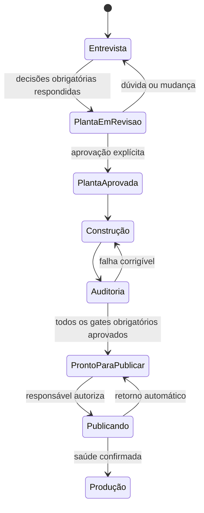
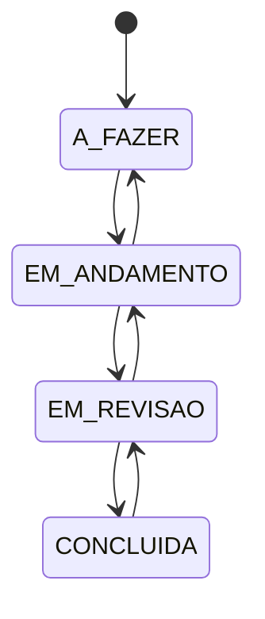

# Regras de Negócio e Invariantes Absolutas

> **Status:** APROVADO PELO USUÁRIO EM 2026-09-27  
> **Regra:** uma implementação que viole qualquer invariante crítica não pode ser publicada.

## 1. Invariantes do Aura Code

| ID | Regra inegociável |
|---|---|
| AC-INV-001 | Nenhum código de aplicação é gerado antes de a planta estar completa e explicitamente aprovada. |
| AC-INV-002 | A IA não decide regra de negócio, interface, permissão, dado ou erro em nome do usuário. |
| AC-INV-003 | Projeto inexistente, vazio, incompatível ou não inspecionado nunca recebe aprovação. |
| AC-INV-004 | Toda garantia publicada possui estado, horário, versão do verificador, escopo e evidência imutável. |
| AC-INV-005 | “Não executado” e “não aplicável” nunca contam como “aprovado”. |
| AC-INV-006 | Falhas críticas de segurança, segredo, isolamento entre empresas, migração ou recuperação não admitem exceção. |
| AC-INV-007 | Exceção não crítica registra responsável, motivo, alcance e vencimento; vencida, volta a bloquear. |
| AC-INV-008 | Segredo nunca entra em código, prompt, log, telemetria, relatório ou pacote de suporte. |
| AC-INV-009 | Conteúdo externo é dado não confiável e não pode conceder instruções ou permissões ao agente. |
| AC-INV-010 | Acesso de rede do agente é negado por padrão e permitido apenas por destino e tarefa autorizados. |
| AC-INV-011 | Ação irreversível, publicação e mudança sensível exigem confirmação humana identificada. |
| AC-INV-012 | Cada afirmação pública de capacidade aponta para prova válida, escopo e limitação. |
| AC-INV-013 | Português e inglês têm os mesmos identificadores de mensagem e o mesmo significado operacional. |
| AC-INV-014 | Uma skill instalada só é executável se contrato, arquivos, versão e compatibilidade forem válidos. |
| AC-INV-015 | Atualização cria backup e oferece retorno à versão anterior antes de migrar o estado. |
| AC-INV-016 | O SaaS de validação não pode superar, ignorar ou contornar falha do Aura Code; sua construção pausa até a correção do framework, o teste de regressão e a repetição bem-sucedida da etapa pelo fluxo oficial. |
| AC-INV-017 | Código, teste, configuração ou artefato do SaaS criado por intervenção externa ao percurso auditado não pode ser usado como evidência de capacidade do Aura Code. |

## 2. Estados do projeto no Aura Studio

Não existe transição direta de Entrevista para Construção, nem de Auditoria reprovada para Produção.

## 3. Regras da aplicação de validação

### 3.1 Isolamento

- Toda ficha de empresa, projeto, tarefa, comentário, etiqueta e notificação pertence a uma empresa.
- Toda consulta e alteração valida a empresa no servidor e no banco de dados.
- Um identificador válido de outra empresa continua inacessível.
- A troca de empresa ativa não reutiliza permissões da anterior.

### 3.2 Papéis

| Ação | Proprietário | Administrador | Membro | Visitante |
|---|:---:|:---:|:---:|:---:|
| Transferir/excluir empresa | Sim | Não | Não | Não |
| Gerenciar membros, projetos e configurações | Sim | Sim | Não | Não |
| Criar/editar/mover tarefas em projeto participante | Sim | Sim | Sim | Não |
| Comentar e mencionar em projeto participante | Sim | Sim | Sim | Sim |
| Enviar tarefa à lixeira/restaurar | Sim | Sim | Não | Não |
| Consultar projeto convidado | Sim | Sim | Sim | Sim |

### 3.3 Convites

- Convite é individual, de uso único, revogável, vinculado ao e-mail e expira em sete dias.
- Somente proprietário e administrador convidam pessoas.
- Convite usado, expirado ou revogado nunca pode ser reutilizado.
- Toda criação, revogação e aceitação entra no histórico de segurança.

### 3.4 Projetos e tarefas

- O nome do projeto é obrigatório e único dentro da empresa.
- Projeto pode estar ativo ou arquivado; arquivar não apaga dados.
- Fluxo de tarefa: `A_FAZER`, `EM_ANDAMENTO`, `EM_REVISAO`, `CONCLUIDA`.
- Prioridades: `BAIXA`, `MEDIA`, `ALTA`, `URGENTE`.
- Responsável e prazo são opcionais.
- Uma gravação com versão antiga é rejeitada como conflito; dados mais novos não são sobrescritos silenciosamente.
- Itens enviados à lixeira ficam invisíveis no uso comum e recuperáveis por 30 dias; depois são eliminados.

Qualquer transição entre etapas é permitida aos papéis autorizados; a interface pede confirmação apenas ao descartar alterações locais não salvas.

### 3.5 Comentários, menções e notificações

- Comentário pertence a uma tarefa e ao autor; anexos não são aceitos.
- Menção só pode apontar para participante com acesso ao projeto.
- Notificações internas surgem para convite, menção, atribuição, troca de responsável, prazo em 24 horas, atraso e mudança de papel.
- Eventos repetidos equivalentes são agrupados; não há e-mail, SMS ou push na primeira versão, exceto e-mails essenciais de acesso e convite.

## 4. Retenção e exclusão

- Conta ou empresa solicitada para exclusão é desativada imediatamente e restaurável por 30 dias.
- Após 30 dias, os dados ativos são apagados; cópias de segurança expiram em até mais 30 dias.
- Histórico de segurança fica protegido por um ano, com conteúdo pessoal reduzido ao necessário.
- O usuário pode acessar, corrigir, exportar e solicitar exclusão de seus dados.

## 5. Regras de autenticação

- Senha tem ao menos 12 caracteres e é rejeitada se conhecida como vazada.
- Recuperação usa link único que expira em 30 minutos e é invalidado após uso.
- Segundo fator opcional usa aplicativo autenticador e códigos de recuperação; SMS não é usado.
- Sessão comum expira após 12 horas de inatividade; dispositivo confiável pode durar até 30 dias.
- Ações sensíveis pedem nova confirmação e o usuário pode revogar outras sessões.
