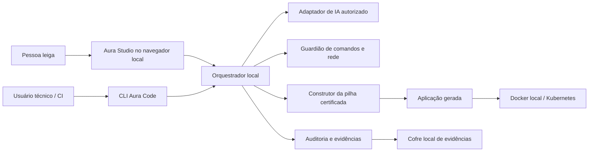
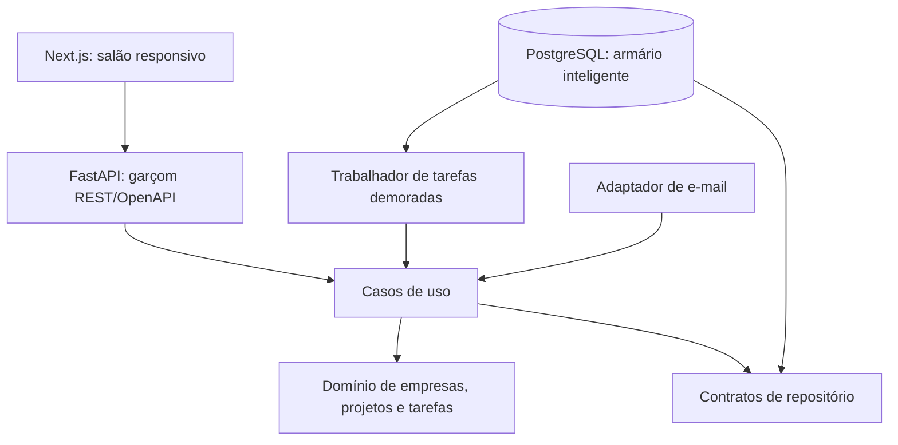

# Arquitetura de Software e Decisões

> **Status:** APROVADO PELO USUÁRIO EM 2026-09-27  
> **Estilo:** monólitos modulares com Clean Architecture e contratos explícitos

## 1. Contexto geral

O Aura Studio é a vitrine e o balcão. O orquestrador é o gerente que coordena a obra. Adaptadores de IA, arquivos, Git, contêineres e nuvem ficam atrás de contratos substituíveis.

## 2. Componentes do núcleo

| Componente | Responsabilidade | Dependências permitidas |
|---|---|---|
| Studio Web | Jornada, acessibilidade, prévias, aprovações | API local do orquestrador |
| CLI | Mesmas capacidades em comandos reproduzíveis | Casos de uso do núcleo |
| Motor de entrevista | Perguntas, decisões, dúvidas e clareza | Repositórios abstratos; catálogo de mensagens |
| Motor SDD | Perfis, 15 cadernos, versões e aprovação | Decisões confirmadas |
| Planejador/construtor | Plano incremental, patches e verificações | Adaptador de IA, Git, sandbox, auditoria |
| Gateway de IA | Interface neutra e primeiro adaptador OpenAI-compatible | Cliente de rede autorizado |
| Guardião | Permissões, segredo, rede, comandos e aprovações | Políticas declarativas |
| Auditor | Executa garantias por linguagem/capacidade | Adaptadores AST e ferramentas externas verificadas |
| Cofre de evidências | Registros imutáveis, hashes, proveniência | Arquivos e SQLite locais |
| Motor de publicação | Build, assinatura, rollout, saúde e retorno | Adaptadores Docker/Kubernetes/CI |
| Catálogo de skills | Descoberta, contrato, compatibilidade e execução | Manifestos versionados |
| Internacionalização | Mensagens PT/EN e teste de equivalência | Catálogos de mensagem |
| Atualizador | Verificação de assinatura, backup, migração e rollback | Canal de versões oficial |

## 3. Camadas obrigatórias

- `domain/`: decisões, requisitos, garantias, políticas e estados puros; não importa infraestrutura.
- `usecases/`: entrevista, aprovação, construção, auditoria, atualização e publicação.
- `adapters/`: CLI, HTTP local, provedores de IA, Git, Docker, Kubernetes e linguagens.
- `infrastructure/`: SQLite, arquivos, chaveiro do sistema, processos e rede.
- `tests/`: contratos, unidades, integrações, segurança e jornadas.

O verificador de arquitetura bloqueia importações contrárias a essa direção.

## 4. Aplicação de validação

O servidor é um monólito modular. Interface, servidor e trabalhador podem ser publicados separadamente, mas compartilham contratos e versão compatível. A fila durável usa PostgreSQL e padrão outbox; não exige Redis inicialmente.

## 5. Decisões arquiteturais

### ADR-001 — Aura Studio local e CLI independente

- **Decisão:** interface web local iniciada pela CLI; nenhum editor obrigatório.
- **Benefício:** experiência para leigos e automação para técnicos.
- **Limite:** primeira versão é individual e não oferece colaboração remota no próprio Studio.

### ADR-002 — Pilha certificada única

- **Decisão:** FastAPI, Next.js, PostgreSQL, Docker e Kubernetes.
- **Benefício:** profundidade de prova e caminho completo.
- **Limite:** outras pilhas não recebem selo até certificação equivalente.

### ADR-003 — Provedor de IA por porta substituível

- **Decisão:** protocolo interno neutro; primeiro adaptador compatível com APIs OpenAI.
- **Benefício:** evita aprisionamento.
- **Limite:** capacidades divergentes dos provedores precisam de negociação explícita.

### ADR-004 — Estado local híbrido

- **Decisão:** Markdown para leitura humana, JSON para contratos e SQLite para estado operacional/evidências indexadas.
- **Benefício:** transparência e consultas confiáveis.
- **Limite:** backup deve preservar os três formatos de modo consistente.

### ADR-005 — Monólito modular

- **Decisão:** núcleo e aplicação de prova começam organizados por módulos, não microserviços.
- **Benefício:** operação simples sem abandonar limites claros.
- **Limite:** extração futura exige respeitar os contratos desde o início.

### ADR-006 — Motor neutro de CI

- **Decisão:** etapas de verificação são comandos locais; GitHub Actions é apenas o primeiro adaptador.
- **Benefício:** qualquer CI pode reproduzir os gates.

### ADR-007 — AL3 com responsabilidade humana

- **Decisão:** automação por risco, gates críticos e aprovação humana de produção.
- **Limite:** AL3 não cobre automaticamente sistemas críticos ou regulados.

## 6. Portabilidade

- Sistemas iniciais: Windows e Linux.
- Desenvolvimento reproduzível em Docker/DevContainer.
- Produção em Kubernetes sem serviço proprietário obrigatório.
- Integrações de editor usam protocolo público e nunca viram dependência do domínio.
