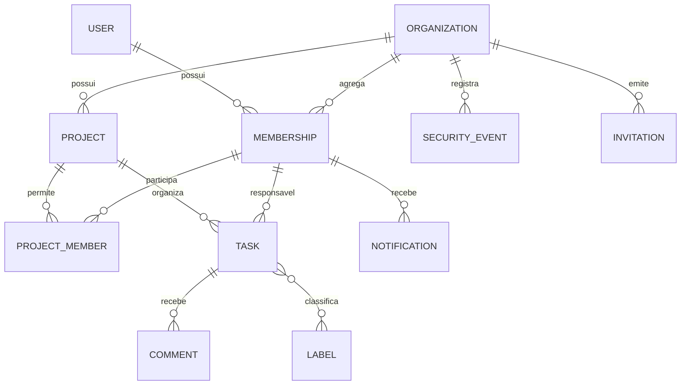

# Modelo de Dados e Armazenamento

> **Status:** APROVADO PELO USUÁRIO EM 2026-09-27  
> **Armários inteligentes:** SQLite local para o Aura Code; PostgreSQL para a aplicação de validação

## 1. Dados do Aura Code

| Entidade | Campos conceituais obrigatórios | Regras |
|---|---|---|
| Workspace | id, nome, caminho, idioma, perfil, estado, versões | Um registro por projeto gerenciado |
| Decision | id estável, pergunta, opções, escolha, justificativa, autor, horário | Nunca sobrescrita; mudança cria nova revisão |
| Requirement | id, texto simples, detalhe técnico, origem, estado | Liga-se a pelo menos uma decisão ou fonte autorizada |
| Specification | id, perfil, arquivo, revisão, hash, estado | Só fica aprovada após autorização explícita |
| BuildIteration | id, objetivo, arquivos, diff, risco, resultado | Máximo de 500 linhas de código/configuração escritos por iteração; artefatos gerados ficam em inventário separado |
| GeneratedArtifact | caminho, gerador/versão, comando normalizado, entradas, hash, tamanho, auditoria, reprodução | Não admite edição manual; só é aceito quando regenerado de entradas autorizadas e reproduzido byte a byte ou por formato canônico declarado |
| GuaranteeRun | id, garantia, alvo, ferramenta/versão, estado, horários | Estados fechados: PASS, FAIL, NOT_RUN, NOT_APPLICABLE, ERROR |
| Evidence | id, tipo, hash, localização, produtor, horário | Imutável; alteração de arquivo invalida a prova |
| Waiver | id, achado, responsável, razão, escopo, vencimento | Proibida para categorias críticas |
| Release | id, versão, artefatos, ambiente, aprovador, estado | Aponta para conjunto fechado de evidências |
| SkillPackage | id, versão, contrato, permissões, compatibilidade, arquivos | Instalável apenas quando completo e íntegro |
| OutboundDisclosure | id, destino, propósito, categorias, hashes, decisão | Não armazena segredo nem conteúdo além do necessário à auditoria |

Markdown é a cópia legível das especificações. JSON contém contratos portáveis. SQLite mantém índices, estados e relações. O sistema detecta divergência por hash e nunca escolhe silenciosamente qual cópia prevalece.

## 2. Dados da aplicação de validação

### 2.1 Dicionário principal

| Entidade | Campos obrigatórios/autorizados |
|---|---|
| User | id UUID, e-mail normalizado, senha derivada, nome de exibição, idioma, fuso horário, estado, datas |
| Organization | id UUID, nome, proprietário, estado de exclusão, datas |
| Membership | empresa, usuário, papel (`OWNER`, `ADMIN`, `MEMBER`, `VISITOR`), estado, datas |
| Invitation | empresa, e-mail, papel, token derivado, emissor, expiração, uso/revogação |
| Project | empresa, nome, descrição opcional, estado ativo/arquivado, criador, datas, versão |
| ProjectMember | projeto, vínculo da empresa, datas |
| Task | empresa, projeto, título, descrição opcional, etapa, prioridade, responsável opcional, prazo opcional, criador, versão, lixeira, datas |
| Label | empresa, projeto, nome, cor acessível, datas |
| TaskLabel | tarefa, etiqueta |
| Comment | empresa, tarefa, autor, texto, datas, estado de remoção |
| Mention | comentário, pessoa mencionada |
| Notification | empresa, destinatário, tipo, objeto, agrupamento, leitura, datas |
| DurableJob | tipo, conteúdo versionado, idempotência, tentativas, próxima execução, estado, erro seguro |
| SecurityEvent | empresa, ator, ação, objeto, resultado, endereço reduzido, horário, elo de integridade |
| Session | usuário, segredo derivado, dispositivo, criação, último uso, expiração, revogação, confiança |
| MFASecret | usuário, segredo cifrado, estado, datas |
| RecoveryCode | usuário, código derivado, uso |
| DeletionRequest | alvo, solicitante, desativação, purga prevista, estado, prova |

Nenhum campo de telefone, endereço, nascimento, fotografia, biografia, orçamento, cliente ou cobrança pertence ao esquema inicial.

## 3. Isolamento e chaves

- Chaves primárias são UUIDs não sequenciais.
- Entidades empresariais carregam `organization_id` e políticas no banco impedem leitura cruzada.
- Unicidade de projeto: `(organization_id, normalized_name)` entre projetos não eliminados.
- E-mail de usuário é único após normalização.
- Índices cobrem empresa + projeto + etapa, responsável, prioridade, prazo, etiqueta e atualização.
- Toda paginação pública usa cursor estável; não depende de posição mutável.

## 4. Concorrência e transações

- Projeto e tarefa possuem versão de concorrência otimista.
- Mudança de papel, transferência de propriedade, aceitação de convite e envio à lixeira são transações atômicas.
- Eventos de notificação e e-mail são gravados na mesma transação de negócio pelo padrão outbox.
- Trabalhadores usam chave de idempotência e novas tentativas limitadas; uma mesma tarefa não produz efeitos duplicados.

## 5. Migração, backup e eliminação

- Migrações são versionadas, ensaiadas em cópia e seguem expansão → convivência → contração.
- Operação destrutiva exige backup verificável e aprovação.
- Meta de backup da aplicação: ponto recuperável a cada 15 minutos; restauração testada em até uma hora.
- Lixeira de tarefa: 30 dias.
- Exclusão de conta/empresa: 30 dias recuperável, seguida de purga ativa; backup expira em até mais 30 dias.
- Eventos de segurança: um ano, com minimização de dados pessoais.
