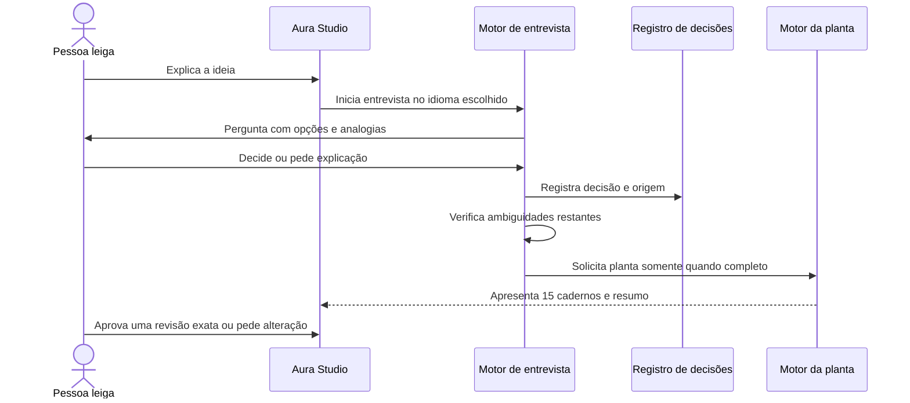
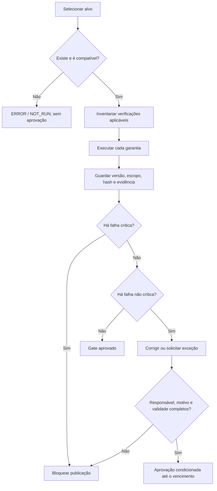

# Fluxos de Trabalho

> **Status:** APROVADO PELO USUÁRIO EM 2026-09-27  
> **Princípio:** cada fluxo mostra o caminho normal, a saída segura e a prova produzida.

## 1. Instalação e diagnóstico

1. Usuário instala o pacote oficial único.
2. Instalador confere assinatura e compatibilidade de sistema.
3. `auracode doctor` verifica CLI, Studio, skills, modelos, verificadores, Docker, Git e permissões.
4. Cada item recebe `PASS`, `FAIL`, `NOT_RUN` ou `NOT_APPLICABLE` com orientação simples.
5. Falha obrigatória impede iniciar a etapa dependente, não o restante do diagnóstico.
6. Resultado pode ser exportado sem segredos.

## 2. Da ideia à planta

Cancelar preserva respostas já confirmadas. Alterar decisão aprovada invalida somente requisitos, planos e provas afetados, exibindo o impacto antes de prosseguir.

## 3. Construção assistida

1. O planejador seleciona o próximo requisito aprovado.
2. Calcula risco, arquivos permitidos e testes necessários.
3. O guardião concede autonomia apenas a ações seguras e reversíveis.
4. A IA recebe o mínimo de contexto; o Studio mostra destino e categorias enviadas.
5. Código e configuração escritos são limitados a 500 linhas por iteração e ligados ao requisito.
6. Lockfiles, inventários e saídas compiladas que excedam esse limite seguem o gate de artefato gerado: não podem ser editados manualmente; guardam gerador, versão, comando, entradas, hash, tamanho e auditoria; uma segunda geração limpa precisa reproduzir o resultado declarado.
7. Testes e verificadores executam em ambiente isolado.
8. Falha retorna à construção com evidência; sucesso cria checkpoint Git.
9. A interface explica resultado em linguagem simples e oferece detalhes técnicos.

Arquivos externos nunca alteram essas regras. Instruções encontradas em páginas, dependências ou documentos são tratadas como texto não confiável.

### 3.1 Freio obrigatório durante a construção do SaaS de validação

1. Toda etapa do SaaS é iniciada por uma capacidade pública do Aura Code, exatamente como seria para um usuário.
2. Se a capacidade faltar, falhar, gerar resultado incorreto ou exigir correção manual, a etapa para e não é marcada como concluída.
3. O defeito é reduzido a uma reprodução mínima e recebe classificação de causa.
4. Sendo falha do Aura Code, primeiro se cria um teste de regressão que falha.
5. Corrige-se o framework e executa-se toda a suíte afetada.
6. A etapa do SaaS é reiniciada em workspace limpo, sem reaproveitar o conserto manual.
7. Só o resultado produzido pelo percurso corrigido entra na aplicação e nas evidências.

É proibido copiar para o SaaS um arquivo preparado fora do construtor, editar silenciosamente sua saída ou chamar uma ferramenta interna de modo indisponível ao usuário para fazer a demonstração passar.

## 4. Auditoria e exceção

Não há média geral. A tela mostra garantias individualmente e deixa visível qualquer parte não executada.

## 5. Publicação gradual

1. Revalidar planta aprovada, testes, segurança, dependências, migrações e backup.
2. Gerar artefatos imutáveis, inventário de componentes, assinatura e prova de origem.
3. Publicar em ambiente de homologação e executar testes de fumaça.
4. Responsável humano revisa evidências e autoriza produção.
5. Liberar gradualmente para uma parcela do tráfego.
6. Verificar saúde, taxa de erros e latência.
7. Ampliar até 100% se saudável; retornar automaticamente se critérios falharem.
8. Registrar versão, aprovador, horários, resultado e evidências.

## 6. Atualização do Aura Code

1. Consultar canal oficial sem enviar telemetria.
2. Verificar assinatura e compatibilidade da versão.
3. Mostrar alterações e pedir autorização.
4. Criar checkpoint Git e backup versionado do SQLite e arquivos gerenciados.
5. Ensaiar migração e executar verificações.
6. Ativar versão nova.
7. Se saúde falhar, restaurar versão e estado anterior.

## 7. Recuperação de desastre

1. Declarar incidente e impedir novas escritas se necessário.
2. Selecionar cópia íntegra com perda máxima de 15 minutos.
3. Restaurar em ambiente isolado e verificar integridade e isolamento.
4. Trocar o serviço somente após testes de fumaça.
5. Meta: serviço restaurado em até uma hora.
6. Produzir análise posterior, ações e responsáveis sem culpabilização.

## 8. Fluxos da aplicação de validação

### Entrada de membro

Administrador envia convite → sistema grava evento e trabalho de e-mail → destinatário abre link em até 7 dias → endereço é conferido → vínculo é criado uma única vez → convite é invalidado → histórico registra o resultado.

### Trabalho em tarefa

Participante cria tarefa → servidor valida empresa e projeto → grava tarefa e evento de notificação na mesma transação → trabalhador entrega notificações internas → atualizações exigem a versão lida → conflito apresenta os dois estados sem perda silenciosa.

### Exclusão

Proprietário solicita excluir empresa → confirma novamente a identidade → empresa é desativada → pode restaurar por 30 dias → processo durável elimina dados ativos → backups expiram em até mais 30 dias → prova de conclusão é registrada.
