# Instalação, Ambientes e Publicação

> **Status:** APROVADO PELO USUÁRIO EM 2026-09-27  
> **Ambientes:** local, CI, homologação e produção

## 1. Instalação do Aura Code

- Um pacote oficial instala CLI, Aura Studio, skills, modelos e verificadores.
- O pacote inclui manifestos e recursos no artefato publicado; não depende do repositório clonado.
- Assinatura e hash são verificados antes da ativação.
- `auracode doctor` comprova completude e explica correções.
- Windows e Linux são matrizes obrigatórias; macOS fica marcado como não certificado até fase posterior.

## 2. Desenvolvimento isolado

- DevContainer/Aura Cage usa usuário sem privilégios e montagem mínima.
- Rede é negada por padrão e liberada por lista explícita.
- Segredos entram por mecanismos temporários somente leitura e não são incluídos em imagens.
- Aura Worktree mantém alterações experimentais fora da branch ativa.
- Docker Compose oferece Next.js, FastAPI, trabalhador, PostgreSQL e capturador local de e-mail.

## 3. Pipeline reproduzível

```mermaid
flowchart LR
    P[Pull request] --> Q[Qualidade e contratos]
    Q --> T[Testes e mutação]
    T --> S[Segurança e dependências]
    S --> B[Build reproduzível]
    B --> A[SBOM, assinatura e proveniência]
    A --> H[Homologação]
    H --> R[Testes de fumaça e recuperação]
    R --> G[Aprovação humana]
    G --> C[Rollout gradual]
    C --> O[Observação ou rollback]
```

GitHub Actions é o primeiro arquivo de automação gerado. Cada etapa chama comandos locais equivalentes para permitir outro provedor de CI.

## 4. Kubernetes portátil

- Manifesta serviços web, API e trabalhador separadamente.
- Configura verificações de vida, prontidão e inicialização.
- Executa como usuário sem privilégios, sistema de arquivos somente leitura quando possível e permissões mínimas.
- Segredos entram por interface padrão de segredo; nenhum operador proprietário é obrigatório.
- Banco PostgreSQL pode ser operado internamente ou fornecido como serviço, desde que cumpra backup, criptografia e restauração.
- Políticas de rede permitem apenas fluxos necessários.

## 5. Migrações

1. Criar backup e validar restauração.
2. Ensaiar migração contra cópia representativa.
3. Aplicar etapa expansiva compatível com versão antiga.
4. Publicar versão nova gradualmente.
5. Confirmar saúde e concluir preenchimentos em lote retomáveis.
6. Remover estrutura antiga somente em release posterior, com aprovação.

## 6. Rollout e retorno

- Nova versão recebe parcela pequena do tráfego.
- Falha de saúde, erro crítico, quebra de isolamento, incompatibilidade ou migração interrompe a ampliação.
- Retorno aponta tráfego à versão anterior compatível; não tenta desfazer automaticamente uma transformação destrutiva.
- A publicação chega a 100% apenas após janela saudável registrada.

## 7. Backup e continuidade

- Ponto recuperável no máximo a cada 15 minutos.
- Cópias criptografadas e separadas do ambiente primário.
- Exercícios periódicos restauram dados em ambiente isolado e medem meta de uma hora.
- Backup não testado aparece como garantia reprovada.
- Procedimentos P1–P4, responsáveis, comunicação e análise posterior acompanham a operação.

## 8. Gate de produção

Exige planta aprovada, zero falha crítica, exceções válidas, testes e acessibilidade, SBOM, assinatura, backup restaurável, migração ensaiada, observabilidade ativa, rollback testado e pessoa responsável identificada.
