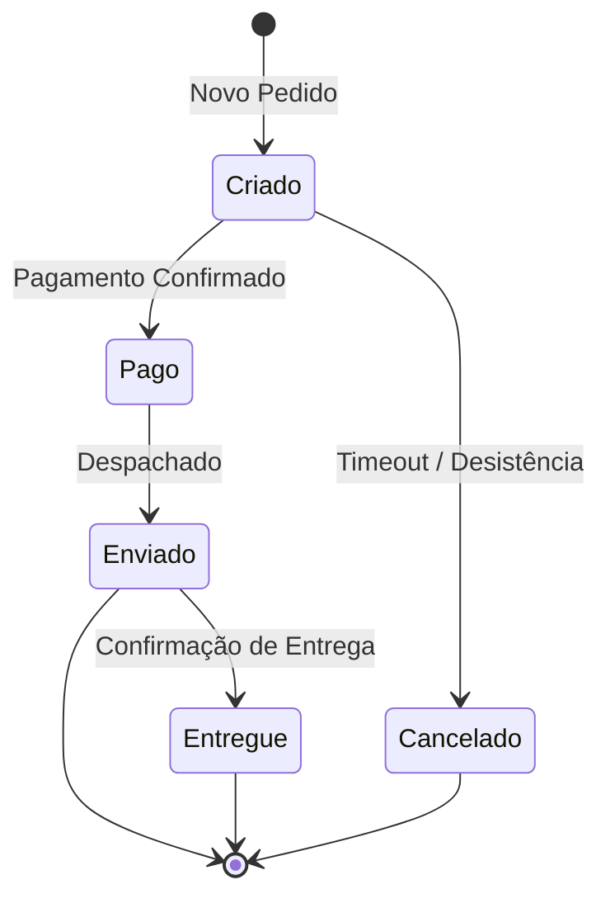

# Regras de Negócio e Invariantes Absolutas (02 — RULES)

> **Status:** RASCUNHO / EM REVISÃO / APROVADO PELO USUÁRIO  
> **Propósito:** Definir os limites inegociáveis que o sistema NUNCA pode violar.  

---

## 1. Invariantes de Domínio (Regras Duras)
*Invariantes são condições que devem ser verdadeiras em todo e qualquer estado válido do sistema.*

- **INV-01:** [Ex: O saldo de uma conta corrente nunca pode ficar negativo sem autorização de limite de crédito pré-aprovado]
- **INV-02:** [Ex: Nenhum pedido pode ser concluído sem que pelo menos um item esteja associado]
- **INV-03:** [Ex: O valor total do pedido deve ser exatamente igual à soma dos itens + frete - descontos]

---

## 2. Regras de Transição de Estado

---

## 3. Limites Quantitativos e Restrições de Operação
| Entidade | Campo / Parâmetro | Limite Mínimo | Limite Máximo | Ação ao Exceder |
| :--- | :--- | :--- | :--- | :--- |
| Pagamento | Valor Transação | R$ 0,01 | R$ 50.000,00 | Rejeitar com erro 422 |
| Upload | Tamanho Arquivo | 1 Byte | 10 MB | Rejeitar antes do upload |
