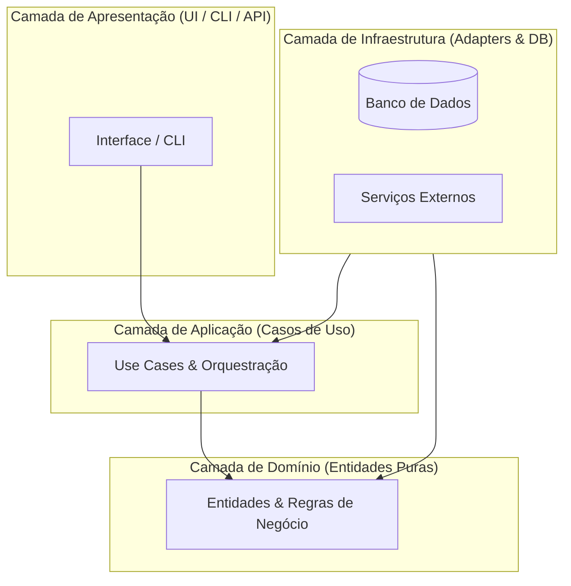

# Arquitetura de Software e ADRs (03 — ARCHITECTURE)

> **Padrão:** Clean Architecture de 4 Camadas  
> **Estilo:** C4 Model (Contexto, Contêineres, Componentes)  

---

## 1. Visão Arquitetural em Camadas

---

## 2. Contratos e Regras de Importação
- `domain/` nunca pode importar de nenhuma outra camada (0 dependências externas).
- `usecases/` só pode importar de `domain/`.
- `adapters/` conecta o mundo exterior aos casos de uso.
- `infrastructure/` implementa repositórios e clientes de rede definidos por interfaces no domínio.

---

## 3. Registro de Decisões Arquiteturais (ADRs)

### ADR-001: [Título da Decisão, ex: Adoção de SQLite para Persistência Local]
- **Status:** Aprovado
- **Contexto:** [Qual era a necessidade ou problema]
- **Decisão:** [O que foi decidido]
- **Consequências Positivas:** [Benefícios obtidos]
- **Consequências Negativas / Tradeoffs:** [Limitações aceitas]
