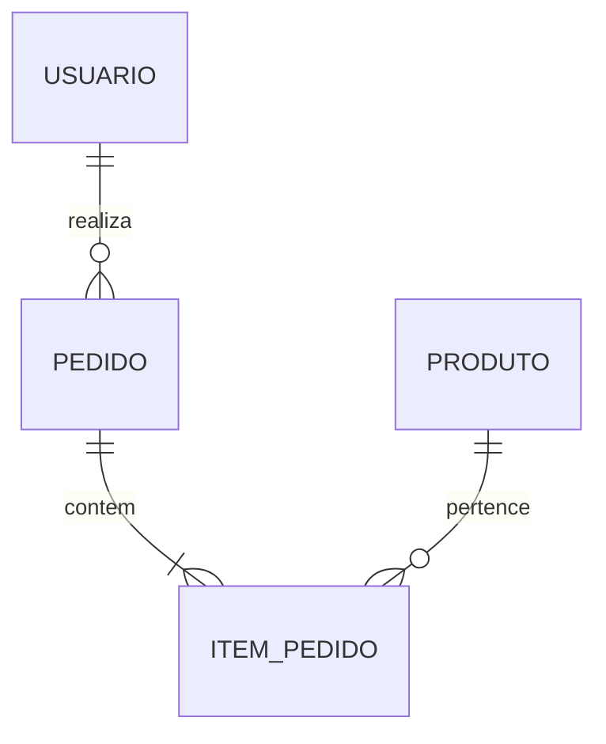

# Modelo de Dados e Armazenamento (04 — DATA-MODEL)

> **Tipo de Armazenamento:** Relacional / Documento / Em Memória  
> **Mecanismo de Migração:** Declarativo / Versionado  

---

## 1. Diagrama Entidade-Relacionamento (ERD)

---

## 2. Dicionário de Dados e Esquema de Tabelas

### Entidade: `Usuario`
| Campo | Tipo | Nulo? | Chave | Descrição |
| :--- | :--- | :--- | :--- | :--- |
| `id` | UUID / String | Não | PK | Identificador único global |
| `email` | String(255) | Não | Unique | Endereço de e-mail verificado |
| `nome` | String(100) | Não | - | Nome completo do usuário |
| `criado_em` | Timestamp | Não | - | Data e hora de criação UTC |

---

## 3. Estratégia de Indexação e Chaves
- Índice único em `Usuario.email`.
- Índice composto em `Pedido(usuario_id, criado_em)`.
