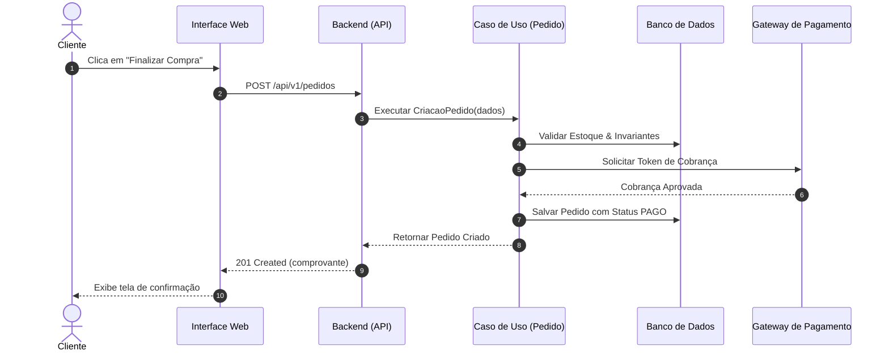

# Fluxos de Trabalho e Diagramas de Sequência (06 — WORKFLOWS)

> **Propósito:** Mapear passo a passo como as interações acontecem no tempo entre atores e sistemas.

---

## 1. Fluxo Principal: Criação e Liquidação de Pedido

---

## 2. Fluxos Alternativos e Compensatórios
- **Falha no Gateway de Pagamento:** Pedido é marcado como `PENDENTE_PAGAMENTO` e cancelado automaticamente após 15 minutos de inatividade.
