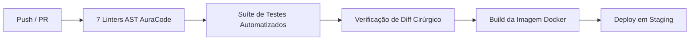

# Deploy, Infraestrutura e DevContainers (12 — DEPLOY)

> **Isolamento de Ambiente:** Docker / DevContainer hermético  
> **Estratégia de Rollout:** Blue-Green / Imutável  

---

## 1. Ambiente DevContainer (A Jaula do Agente)
- Todo o ciclo de vida do agente deve operar confinado em um container Docker (`.devcontainer/`).
- O container deve operar com usuário não-root e ter capabilidades de rede limitadas por firewall *Default-Deny*.
- Montagem de segredos deve ser configurada estritamente como `readonly`.

---

## 2. Pipeline de CI/CD (GitHub Actions)

---

## 3. Critérios de Rollback Automático
- Health check falhar 3 vezes consecutivas após o deploy.
- Aumento súbito de exceções não tratadas detectado pelo sistema de telemetria.
